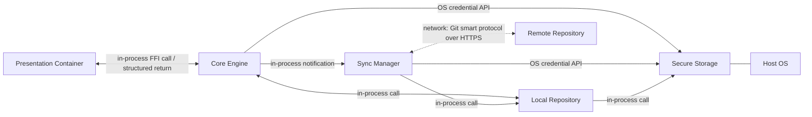

# Logical Containers

## Structure

The synchronous editing path runs entirely through the left edge: keystrokes cross the FFI boundary, and the Core serves them from memory and the local index without ever touching the network. The dotted edge is the only asynchronous, potentially failing connection in the system, which is why it belongs to the Sync Manager alone. Local Repository's dependence on Secure Storage is drawn directly rather than left transitive through Core because the key read happens at index open, not per call; Core notifies Sync in-process when a commit tier fires, which is how the scheduler learns there is work.

## 1. Presentation Container
- **Logical Type:** UI Client (Flutter)
- **Responsibility:** Captures user input and renders the hybrid Markdown editor interface based on state provided by the Core Engine. It is strictly stateless and maintains no persistent data of its own.
- **Inputs / Outputs:** Receives structured Abstract Syntax Trees (AST) and search results; outputs keystrokes, block modifications, and interaction events.
- **Depends on:** Core Engine.

## 2. Core Engine
- **Logical Type:** Application Logic, State Manager, & Crypto Boundary
- **Responsibility:** Manages the active "draft" state of open notes, parses raw Markdown into structured ASTs, handles inline conflict resolution logic, encrypts/decrypts data flowing to the Local Repository, and acts as the bridge (via FFI) to the Presentation Container.
- **Inputs / Outputs:** Receives UI events; outputs ASTs. Reads/writes encrypted payloads to Local Repository. Retrieves keys from Secure Storage.
- **Depends on:** Local Repository, Sync Manager, Secure Storage.

## 3. Local Repository (Index & Storage)
- **Logical Type:** Storage Boundary
- **Responsibility:** Persists the Open Knowledge Format (OKF) directory tree and maintains an application-level-encrypted (SQLCipher) search index for graph relationships and full-text queries. The raw OKF directory tree itself is **not** encrypted by this container, so that native Git merge tooling can operate on plaintext files; whatever at-rest protection those files have comes from the host operating system and is not a guarantee this system delivers (see `prd/constraints.md`).
- **Inputs / Outputs:** Receives finalized encrypted document commits and search queries; outputs queried encrypted documents.
- **Depends on:** Secure Storage (retrieves the root key before the SQLCipher index can be opened; corrected from "None" once Epic B's implementation made this dependency concrete — see `rust/src/db/connection.rs`).

## 4. Sync Manager
- **Logical Type:** Background Worker / Scheduler
- **Responsibility:** Handles asynchronous communication with the Remote Repository. It pulls remote commits, pushes local commits, and manages OAuth tokens. **Optional at runtime:** a Workspace with no Remote attached is fully functional with this container idle, and every other container's responsibilities hold unchanged in that state. This corrects an implicit assumption in v1.0.x that a Remote always exists — see `prd/out-of-scope/mandatory-account-on-first-run.md` and `tech-spec/adrs/ADR-005-local-first-workspace.md`.
- **Inputs / Outputs:** Reads commits from the Local Repository; pushes commits to the Remote Repository; reports synchronization state upward so the Presentation Container can render it.
- **Depends on:** Local Repository, Remote Repository (when attached), Secure Storage.

## 5. Secure Storage (OS Boundary)
- **Logical Type:** Hardware/OS Boundary
- **Responsibility:** Safely stores OAuth refresh tokens and the AES-256 root encryption key for the Local Repository. The two are independent: the root key is created during Workspace bootstrap and exists whether or not any provider is ever authorized, while tokens exist only after an opt-in connection. v1.0.x coupled them by generating the root key inside the OAuth handshake, which made an unauthenticated user unable to open an index at all; corrected in `flows/flow-workspace-bootstrap.md`.
- **Inputs / Outputs:** Receives tokens/keys for storage; outputs tokens/keys on request, including a readback path so a restart can restore an existing session rather than re-prompting.
- **Depends on:** Host OS (Keychain/Keystore).
