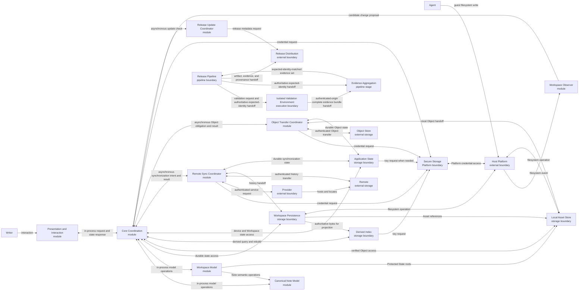

# Logical boundaries

The System/Native archetype uses module, Platform, storage, external-service, and release-pipeline boundaries. These boundaries describe responsibilities and communication categories, not physical packages or protocols.

## Structure

## Presentation and Interaction

- **Boundary kind:** Module.
- **Logical type:** Desktop interaction surface.
- **Responsibility:** Captures Writer intent and renders authoritative state, warnings, Decisions, Suggestions, diagnostics, and release information.
- **Inputs and outputs:** Sends interaction commands. Receives Note, Workspace, session, synchronization, and recovery state.
- **Depends on:** Core Coordination.

This boundary can own ephemeral selection and focus. Durable preferences and per-Workspace session state belong to Application State.

## Core Coordination

- **Boundary kind:** Module.
- **Logical type:** Application coordinator and authority boundary.
- **Responsibility:** Serializes commands against authoritative model state, enforces authority and conformance, and coordinates local and external state machines.
- **Inputs and outputs:** Receives Writer actions, guest-change proposals, synchronization results, and Object results. Emits authoritative state and durable obligations.
- **Depends on:** Canonical Note Model, Workspace Model, Workspace Persistence, Derived Index, Application State, Secure Storage, Workspace Observer, Remote Sync Coordinator, Object Transfer Coordinator, and Release Update Coordinator.

## Canonical Note Model

- **Boundary kind:** Module.
- **Logical type:** Source-backed semantic model.
- **Responsibility:** Defines Note-local values and operations for parsing, rendering, source-preserving edits, undo, find and replace, Links, Assets, Suggestion representation, and conformance.
- **Inputs and outputs:** Accepts Note source and semantic operations. Returns structured Note state, source ranges, and source-preserving results.
- **Depends on:** No other logical boundary.

The boundary owns the logical model only. Stage 3 selects the physical schema, parser foundation, source-range representation, and inter-module projection.

## Workspace Model

- **Boundary kind:** Module.
- **Logical type:** Workspace authority model.
- **Responsibility:** Solely owns authoritative Workspace and session state: the Directory tree, canonical paths, Note identity, open-session registry, Protected State, lifecycle provenance, and the lifecycle of Suggestions, Lifecycle Decisions, Asset Decisions, and reconciliation records.
- **Inputs and outputs:** Accepts Workspace operations and candidate external states. Returns authoritative tree state, Decisions, and retention roots.
- **Depends on:** Canonical Note Model.

## Workspace Persistence

- **Boundary kind:** Storage boundary.
- **Logical type:** Local authoritative storage.
- **Responsibility:** Persists Note source, Directories, recoverable local history, and atomic lifecycle outcomes inside the Workspace boundary.
- **Inputs and outputs:** Stores and retrieves authoritative Workspace bytes and Versions.
- **Depends on:** Host Platform for filesystem operations.

## Local Asset Store

- **Boundary kind:** Storage boundary.
- **Logical type:** Local authoritative Object storage.
- **Responsibility:** Owns verified local Object bytes, active offline availability, hydration handoff, cache eviction, and retention of bytes reachable from Protected State.
- **Inputs and outputs:** Accepts verified Object writes and retention roots. Returns verified bytes, availability, and eviction outcomes.
- **Depends on:** Host Platform, Workspace Model for Protected State roots, and Workspace Persistence for Asset references.

## Derived Index

- **Boundary kind:** Storage boundary.
- **Logical type:** Rebuildable local projection.
- **Responsibility:** Supports search, title lookup, backlinks, conformance inventory, and incremental Workspace views without becoming authoritative.
- **Inputs and outputs:** Accepts validated Workspace changes. Returns queries and rebuild progress.
- **Depends on:** Workspace Persistence and Secure Storage.

## Application State

- **Boundary kind:** Storage boundary.
- **Logical type:** Non-Workspace durable state.
- **Responsibility:** Persists and restores snapshots of device preferences, per-Workspace session state, drafts, operation intents, reconciliation records, synchronization presentation, and migration metadata. It doesn't own authoritative session state.
- **Inputs and outputs:** Persists and restores device or Workspace-scoped application state.
- **Depends on:** Secure Storage when state contains encrypted aggregate Note data.

Device preferences never enter Workspace content. Session and navigation state remain partitioned by Workspace.

## Workspace Observer

- **Boundary kind:** Module.
- **Logical type:** Platform event adapter.
- **Responsibility:** Converts filesystem event bursts into debounced change proposals without deciding authority or conformance.
- **Inputs and outputs:** Receives Platform events and emits candidate creates, edits, moves, renames, and deletes.
- **Depends on:** Host Platform and Core Coordination.

## Remote Sync Coordinator

- **Boundary kind:** Module.
- **Logical type:** Optional asynchronous coordinator.
- **Responsibility:** Connects a Workspace to a private Remote, detects local and incoming history, coordinates reconciliation, and reports distinct synchronization states.
- **Inputs and outputs:** Accepts durable synchronization intents. Returns authentication, privacy, transfer, divergence, and completion outcomes.
- **Depends on:** Provider, Remote, Secure Storage, Workspace Persistence, Application State, and Core Coordination.

## Object Transfer Coordinator

- **Boundary kind:** Module.
- **Logical type:** Optional asynchronous Object coordinator.
- **Responsibility:** Validates at connection, periodically, and before publication that anonymous callers can't list, read, write, or delete in the Object Store prefix; uploads and verifies required Objects before history publication; hydrates Objects; and coordinates migration, repair, rotation, and cleanup.
- **Inputs and outputs:** Accepts Object obligations and retention roots. Returns verification, hydration, migration, and recovery outcomes.
- **Depends on:** Object Store, Secure Storage, Local Asset Store, Application State, and Core Coordination.

## Secure Storage

- **Boundary kind:** Platform boundary.
- **Logical type:** Credential and key persistence.
- **Responsibility:** Persists index keys, Provider credentials, and Object Store credentials outside Workspace content and diagnostics.
- **Inputs and outputs:** Stores, reads, rotates, and removes secret material for authorized callers.
- **Depends on:** Host Platform.

## Host Platform

- **Boundary kind:** External boundary.
- **Logical type:** Operating system and filesystem authority.
- **Responsibility:** Owns window chrome, process lifecycle, filesystem events, secure storage, file selection, installation, and package-manager behavior.
- **Inputs and outputs:** Provides Platform services and lifecycle signals.
- **Depends on:** None.

## Provider, Remote, and Object Store

- **Boundary kind:** External service and storage boundaries.
- **Logical type:** Optional user-controlled synchronization services.
- **Responsibility:** The Provider authorizes and locates a private Remote. The Remote stores Workspace history. The Object Store stores immutable Object bytes under the Writer's control.
- **Inputs and outputs:** Accept authenticated repository or Object operations and return explicit authorization, privacy, integrity, and availability outcomes.
- **Depends on:** External network availability and user-controlled accounts.

## Release Pipeline

- **Boundary kind:** Pipeline boundary.
- **Logical type:** Build, verification, and publication boundary.
- **Responsibility:** Produces each supported artifact, assigns validation roles, establishes authoritative expected identity, requires complete accepted evidence, and publishes artifact integrity with authenticated build provenance.
- **Inputs and outputs:** Accepts a release identity and Platform matrix. Sends validation and aggregation the expected tested-source, workflow-execution, base, release, build, corpus, run, and required-role identities. Emits verified artifacts, evidence, and metadata to Release Distribution.
- **Depends on:** Isolated Validation Environment, Evidence Aggregation, supported Platform environments, and Release Distribution.

The pipeline assigns the following validation roles:

- Linux x86-64 provides common functional-matrix, performance, and required exact platform-regression evidence. Its platform regression isn't authoritative product visual evidence.
- Apple Silicon macOS 26 provides common functional-matrix, performance, and the sole authoritative product visual evidence.
- macOS 15 provides common functional-matrix evidence for compatibility only.

## Isolated validation environment

- **Boundary kind:** Execution boundary.
- **Logical type:** Pipeline-owned System/Native validation environment.
- **Responsibility:** Runs one assigned validation role while owning its display, compositor, input, and process state independently of the Writer's active desktop.
- **Inputs and outputs:** Accepts an artifact, run identity, required role, and authoritative expected source, execution, base, release, build, and corpus identities. Emits one complete bundle containing the role manifest and every named evidence file.
- **Depends on:** Release Pipeline.

## Evidence aggregation

- **Boundary kind:** Pipeline stage.
- **Logical type:** Evidence integrity and acceptance boundary.
- **Responsibility:** Authenticates managed validation origin, verifies complete bundle integrity, and compares captured identity with authoritative expected identity before isolated aggregation.
- **Inputs and outputs:** Accepts expected source, execution, base, release, build, corpus, run, and required-role identities from Release Pipeline. Accepts one complete evidence bundle from each role through an authenticated-origin and integrity-checked handoff. Credentialed acquisition produces verified read-only inputs. A separate credential-free, non-networked coordinator produces machine results through one writable output boundary. Returns an accepted complete set or explicit unmanaged, untrusted, missing, mismatched, stale, corrupt, credential-exposed, or isolation-failed outcomes.
- **Depends on:** Isolated Validation Environment and Release Pipeline.

All three roles must satisfy the common functional matrix. macOS 15 evidence can't satisfy a performance, Linux platform-regression, or authoritative visual role. Linux platform-regression evidence can't satisfy the macOS 26 authoritative product visual role. Evidence from the Writer's active desktop is invalid even when the captured output appears correct.

## Release Update Coordinator

- **Boundary kind:** Module.
- **Logical type:** Optional asynchronous metadata coordinator.
- **Responsibility:** Checks compatible release metadata, reports a higher `0.x` release, and hands installation authority to the Host Platform or package manager.
- **Inputs and outputs:** Receives update-check intent and returns compatible release information. It never replaces installed binaries.
- **Depends on:** Release Distribution and Core Coordination.

## Release Distribution

- **Boundary kind:** External service boundary.
- **Logical type:** Artifact and release-metadata distribution.
- **Responsibility:** Publishes supported artifacts, integrity data, authenticated provenance, compatibility metadata, and release information without installing binaries.
- **Inputs and outputs:** Accepts verified release outputs and serves immutable artifacts and compatible release metadata.
- **Depends on:** External network availability and the Release Pipeline.
