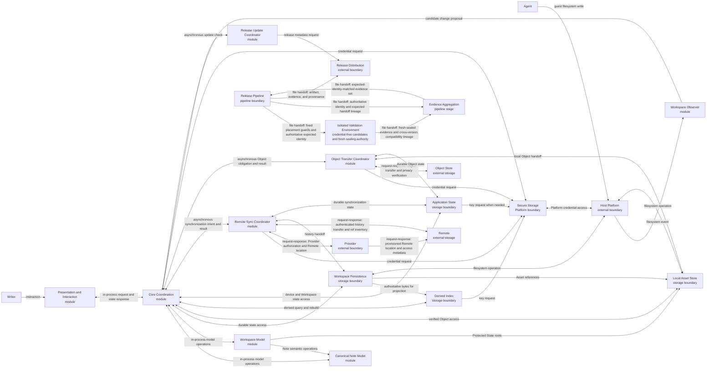

# Logical boundaries

The System/Native archetype uses module, Platform, storage, external-service, and release-pipeline boundaries. These boundaries describe responsibilities and communication categories, not physical packages or protocols.

## Structure

## Presentation and Interaction

- **Boundary kind:** Module.
- **Logical type:** Desktop interaction surface.
- **Responsibility:** Captures Writer intent and renders authoritative state, warnings, Decisions, Suggestions, diagnostics, and release information.
- **Inputs and outputs:** Sends interaction commands. Receives Note, Workspace, session, synchronization, and recovery state.
- **Depends on:** Core Coordination.

This boundary can own ephemeral selection and focus. Durable preferences and per-Workspace session state belong to Application State.

## Core Coordination

- **Boundary kind:** Module.
- **Logical type:** Application coordinator and authority boundary.
- **Responsibility:** Serializes commands against authoritative model state, enforces authority and conformance, and coordinates local and external state machines.
- **Inputs and outputs:** Receives Writer actions, guest-change proposals, synchronization results, and Object results. Emits authoritative state and durable obligations.
- **Depends on:** Canonical Note Model, Workspace Model, Workspace Persistence, Local Asset Store, Derived Index, Application State, Secure Storage, Workspace Observer, Remote Sync Coordinator, Object Transfer Coordinator, and Release Update Coordinator.

## Canonical Note Model

- **Boundary kind:** Module.
- **Logical type:** Source-backed semantic model.
- **Responsibility:** Defines Note-local values and operations for parsing, rendering, source-preserving edits, undo, find and replace, Links, Assets, Suggestion representation, and conformance.
- **Inputs and outputs:** Accepts Note source and semantic operations. Returns structured Note state, source ranges, and source-preserving results.
- **Depends on:** No other logical boundary.

The boundary owns the logical model only. Stage 3 selects the physical schema, parser foundation, source-range representation, and inter-module projection.

## Workspace Model

- **Boundary kind:** Module.
- **Logical type:** Workspace authority model.
- **Responsibility:** Solely owns authoritative Workspace and session state: the Directory tree, canonical paths, Note identity, open-session registry, Protected State, lifecycle provenance, and the lifecycle of Suggestions, Lifecycle Decisions, Asset Decisions, and reconciliation records.
- **Inputs and outputs:** Accepts Workspace operations and candidate external states. Returns authoritative tree state, Decisions, and retention roots.
- **Depends on:** Canonical Note Model.

## Workspace Persistence

- **Boundary kind:** Storage boundary.
- **Logical type:** Local authoritative storage.
- **Responsibility:** Persists Note source, Directories, recoverable local history, and atomic lifecycle outcomes inside the Workspace boundary.
- **Inputs and outputs:** Stores and retrieves authoritative Workspace bytes and Versions.
- **Depends on:** Host Platform for filesystem operations.

## Local Asset Store

- **Boundary kind:** Storage boundary.
- **Logical type:** Local authoritative Object storage.
- **Responsibility:** Owns verified local Object bytes, active offline availability, hydration handoff, cache eviction, and retention of bytes reachable from Protected State.
- **Inputs and outputs:** Accepts verified Object writes and retention roots. Returns verified bytes, availability, and eviction outcomes.
- **Depends on:** Host Platform, Workspace Model for Protected State roots, and Workspace Persistence for Asset references.

## Derived Index

- **Boundary kind:** Storage boundary.
- **Logical type:** Rebuildable local projection.
- **Responsibility:** Supports search, title lookup, backlinks, conformance inventory, and incremental Workspace views without becoming authoritative.
- **Inputs and outputs:** Accepts validated Workspace changes. Returns queries and rebuild progress.
- **Depends on:** Workspace Persistence and Secure Storage.

## Application State

- **Boundary kind:** Storage boundary.
- **Logical type:** Non-Workspace durable state.
- **Responsibility:** Persists and restores snapshots of device preferences, per-Workspace session state, drafts, operation intents, reconciliation records, synchronization presentation, and migration metadata. It doesn't own authoritative session state.
- **Inputs and outputs:** Persists and restores device or Workspace-scoped application state.
- **Depends on:** Secure Storage when state contains encrypted aggregate Note data.

Device preferences never enter Workspace content. Session and navigation state remain partitioned by Workspace.

## Workspace Observer

- **Boundary kind:** Module.
- **Logical type:** Platform event adapter.
- **Responsibility:** Converts filesystem event bursts into debounced change proposals without deciding authority or conformance.
- **Inputs and outputs:** Receives Platform events and emits candidate creates, edits, moves, renames, and deletes.
- **Depends on:** Host Platform and Core Coordination.

## Remote Sync Coordinator

- **Boundary kind:** Module.
- **Logical type:** Optional asynchronous coordinator.
- **Responsibility:** Connects a Workspace to a private Remote, detects local and incoming history, coordinates reconciliation, and reports distinct synchronization states.
- **Inputs and outputs:** Accepts durable synchronization intents. Returns authentication, privacy, transfer, divergence, and completion outcomes.
- **Depends on:** Provider, Remote, Secure Storage, Workspace Persistence, Application State, and Core Coordination.

## Object Transfer Coordinator

- **Boundary kind:** Module.
- **Logical type:** Optional asynchronous Object coordinator.
- **Responsibility:** Validates at connection, periodically, and before publication that anonymous callers can't list, read, write, or delete in the Object Store prefix; uploads and verifies required Objects before history publication; hydrates Objects; and coordinates migration, repair, rotation, and cleanup.
- **Inputs and outputs:** Accepts Object obligations and retention roots. Returns verification, hydration, migration, and recovery outcomes.
- **Depends on:** Object Store, Secure Storage, Local Asset Store, Application State, and Core Coordination.

## Secure Storage

- **Boundary kind:** Platform boundary.
- **Logical type:** Credential and key persistence.
- **Responsibility:** Persists index keys, Provider credentials, and Object Store credentials outside Workspace content and diagnostics.
- **Inputs and outputs:** Stores, reads, rotates, and removes secret material for authorized callers.
- **Depends on:** Host Platform.

## Host Platform

- **Boundary kind:** External boundary.
- **Logical type:** Operating system and filesystem authority.
- **Responsibility:** Owns window chrome, process lifecycle, filesystem events, secure storage, file selection, installation, and package-manager behavior.
- **Inputs and outputs:** Provides Platform services and lifecycle signals.
- **Depends on:** None.

## Provider

- **Boundary kind:** External trust boundary.
- **Logical type:** External authorization and location boundary.
- **Responsibility:** Authorizes the Writer and selects, provisions, and locates an eligible private Remote.
- **Inputs and outputs:** Accepts authorization, Remote selection, provisioning, location, privacy, and access requests. Returns explicit authorization, private Remote location, provisioning, privacy, and access outcomes.
- **Depends on:** Remote, external network availability, and a Writer-controlled Provider account.

## Remote

- **Boundary kind:** External storage and trust boundary.
- **Logical type:** Private external history storage.
- **Responsibility:** Stores and exchanges the private Workspace history for one connected Workspace.
- **Inputs and outputs:** Accepts authenticated history reads, writes, and published-ref enumeration. Returns Workspace history, advertised refs, transfer outcomes, and availability outcomes.
- **Depends on:** Provider, external network availability, and the Writer-controlled private Remote.

## Object Store

- **Boundary kind:** External storage and trust boundary.
- **Logical type:** Writer-controlled external Object storage.
- **Responsibility:** Stores and exchanges immutable Object bytes for a connected Workspace under the Writer's control.
- **Inputs and outputs:** Accepts authenticated Object operations and anonymous list, read, write, and delete privacy probes. Returns verified Object bytes and explicit privacy, integrity, and availability outcomes.
- **Depends on:** External network availability and a Writer-controlled Object Store account.

## Release Pipeline

- **Boundary kind:** Pipeline boundary.
- **Logical type:** Build, verification, and publication boundary.
- **Responsibility:** Produces each supported artifact, defines candidate placement and completion guards, establishes authoritative expected identity, requires complete accepted evidence, and publishes artifact integrity. Only fresh non-executing sealing authenticates provenance.
- **Inputs and outputs:** Accepts a release identity and Platform matrix. From an immutable reviewed validation anchor, it sends validation and aggregation the expected trust-anchor, validation-control signer, tested-source, base, release, build, corpus, run, required-role, and role-specific evidence-class identities. It also sends fixed candidate-placement and topology requirements plus terminal completion expectations. It directs the macOS 26 seal to produce the authenticated cross-version compatibility handoff. It defines the expected producer-to-consumer lineage and emits verified artifacts, evidence, and metadata to Release Distribution.
- **Depends on:** Isolated Validation Environment, Evidence Aggregation, supported Platform environments, and Release Distribution.

The pipeline assigns the following validation roles:

- Linux x86-64 can provide common functional-matrix, performance, and exact platform-regression evidence. Its platform regression isn't authoritative product visual evidence.
- Apple Silicon macOS 26 can provide common functional-matrix, performance, and the sole authoritative product visual evidence.
- macOS 15 can provide common functional-matrix evidence for compatibility only.

## Isolated validation environment

- **Boundary kind:** Execution boundary.
- **Logical type:** Pipeline-owned paired validation environments.
- **Responsibility:** Runs each credential-free candidate role at a placement fixed by trusted workflow. It records placement and completion as runtime guards, not cryptographic hosted-origin proof. It then seals the untrusted file handoff in a separate fresh authority environment that never executes candidate bytes. Within this boundary, the macOS 26 seal owns the authenticated cross-version compatibility handoff.
- **Inputs and outputs:** Candidate commands accept an artifact, run identity, required role, and authoritative expected source, execution, base, release, build, corpus, placement, topology, and completion identities. They receive no credential or provenance authority. A trusted wrapper can upload one complete untrusted handoff containing the role manifest and every named evidence file. The strict-containment role proves candidate-process teardown before upload. Other hosted roles record bounded cleanup without claiming arbitrary-process containment. Each fresh sealing environment validates handoff identity and integrity before it authenticates immutable provenance. Fresh-seal provenance alone cryptographically authenticates the sealing environment's hosted origin.
- **Depends on:** Release Pipeline.

A candidate survivor can corrupt or deny its untrusted upload. That outcome fails the role, but the survivor can't enter the fresh sealing environment, cause candidate bytes to execute there, or gain its provenance authority.

For the cross-version compatibility handoff, the macOS 26 seal validates the producer members and creates the authenticated compatibility stage. It binds the stage's exact identifier and integrity digest to the producing seal locator and provenance. The trusted macOS 15 wrapper acquires that exact stage and verifies its producer-seal binding. It removes the acquisition credential context and exposes verified members read-only to the candidate. The credential-free macOS 15 candidate carries the lineage into its untrusted output. The macOS 15 seal validates that lineage against the trusted wrapper record before carrying it forward.

## Evidence aggregation

- **Boundary kind:** Pipeline stage.
- **Logical type:** Evidence integrity and acceptance boundary.
- **Responsibility:** Treats candidate placement and completion as trusted-workflow and runtime guards. It verifies each fresh sealing environment's hosted origin only through completed provenance. It also checks the trust-anchor relationship and write boundary and verifies uninterrupted cross-version compatibility producer-to-consumer lineage before isolated aggregation.
- **Inputs and outputs:** Accepts authoritative expected identity from Release Pipeline, one fresh-sealed bundle per role, and pipeline-owned candidate and sealing environment records. Candidate placement, topology, labels, and completion remain noncryptographic observations. For the cross-version compatibility handoff, it also accepts the stage identifier, integrity digest, producing macOS 26 seal locator, provenance, and macOS 15 consumer binding. Credentialed acquisition produces verified read-only inputs. A separate credential-free, non-networked coordinator produces machine results through one writable output boundary. The boundary returns an accepted complete set or an explicit rejection.
- **Depends on:** Isolated Validation Environment and Release Pipeline.

Each validation request names the evidence classes that each role must provide. Acceptance requires that exact profile: neither a missing assigned class nor an extra unassigned class is valid. macOS 15 evidence can't satisfy performance, Linux platform-regression, or authoritative visual evidence. Linux platform-regression evidence can't satisfy the macOS 26 authoritative product visual role. Evidence from the Writer's active device is invalid even when the captured output appears correct.

Aggregation rejects candidate placement or completion guard failures without presenting those guards as cryptographic origin. It also rejects unmanaged, candidate-controlled, out-of-boundary, untrusted, missing, duplicated, mismatched, stale, corrupt, or unsealed evidence. For the cross-version compatibility handoff, it rejects any absent, substituted, expired, integrity-mismatched, unauthenticated, wrong-producer, wrong-role, wrong-run, wrong-seal, or consumer-unbound stage. Exposed credentials or failed isolation also reject the evidence set.

## Release Update Coordinator

- **Boundary kind:** Module.
- **Logical type:** Optional asynchronous metadata coordinator.
- **Responsibility:** Checks compatible release metadata, reports a higher `0.x` release, and hands installation authority to the Host Platform or package manager.
- **Inputs and outputs:** Receives update-check intent and returns compatible release information. It never replaces installed binaries.
- **Depends on:** Release Distribution and Core Coordination.

## Release Distribution

- **Boundary kind:** External service boundary.
- **Logical type:** Artifact and release-metadata distribution.
- **Responsibility:** Publishes supported artifacts, integrity data, authenticated provenance, compatibility metadata, and release information without installing binaries.
- **Inputs and outputs:** Accepts verified release outputs and serves immutable artifacts and compatible release metadata.
- **Depends on:** External network availability and the Release Pipeline.
