# Remote connection and authorization flow

**Maps to:** CAP-SYNC-01, CAP-SYNC-05, CAP-SYNC-06, CAP-SYNC-07, CAP-SYNC-08, CAP-SYNC-12.

```mermaid
stateDiagram-v2
    [*] --> LocalOnly
    LocalOnly --> Authorizing: Writer starts connection or join
    Authorizing --> Selecting: Authorization and installation access valid
    Authorizing --> LocalOnly: Cancel, pending approval, or failure
    Authorizing --> AttachedUnauthenticated: Reauthorization fails for an attached Workspace
    Selecting --> Preparing: Eligible private Remote selected or provisioned
    Preparing --> Connected: Prerequisites verified and local history published
    Preparing --> Consolidating: Writer selects another local Workspace
    Consolidating --> Preparing: Identity decisions complete; source unchanged
    Connected --> Refreshing: Authorization nearing expiry
    Refreshing --> Connected: Credentials rotate
    Refreshing --> AuthenticationRequired: Authoritative rejection or revocation
    Refreshing --> RefreshOffline: Transport unavailable
    Refreshing --> RefreshRateLimited: Provider rate limit
    Refreshing --> RefreshRetryable: Retryable service failure
    RefreshOffline --> Refreshing: Connectivity returns
    RefreshRateLimited --> Refreshing: Retry window opens
    RefreshRetryable --> Refreshing: Retry condition clears
    Connected --> PausedPrivacy: Remote becomes public or access is lost
    AuthenticationRequired --> Authorizing: Reauthorize
    AuthenticationRequired --> LocalOnly: Asset-free explicit detach
    AuthenticationRequired --> LocalWithObjectStore: Asset-bearing offline detach retains Object Store
    PausedPrivacy --> Connected: Private access restored
    PausedPrivacy --> LocalOnly: Asset-free explicit detach
    PausedPrivacy --> LocalWithObjectStore: Asset-bearing offline detach retains Object Store
    Connected --> AttachedUnauthenticated: Writer signs out; Remote remains attached
    AttachedUnauthenticated --> Authorizing: Reauthorize
    AttachedUnauthenticated --> LocalOnly: Asset-free explicit detach
    AttachedUnauthenticated --> LocalWithObjectStore: Asset-bearing offline detach retains Object Store
    Connected --> LocalOnly: Asset-free explicit detach completes
    Connected --> LocalWithObjectStore: Asset-bearing offline detach retains Object Store
    LocalWithObjectStore --> Authorizing: Reconnect exact prior Remote
```

## Failure path

- Authorization, approval, selection, provisioning, publication, or Consolidation failure leaves local capabilities available.
- Transport, service, and rate-limit failures don't become authentication-required states.
- Refresh retry states preserve Remote attachment and the current credential pair until rotation succeeds or the Provider authoritatively rejects it.
- A first connection publishes only after Object prerequisites pass for an asset-bearing Workspace.
- Consolidation returns to preparation; identity decisions alone never imply that prerequisites passed or initial publication completed.
- First publication and later pushes stop if any commit reachable from a local publication ref contains `.github/workflows/**`. burlmd doesn't request GitHub workflow-modification permission; the Writer can Consolidate Notes and Assets into a clean Workspace.
- Sign-out removes credentials but not Remote attachment. Only an asset-free Workspace can detach directly to `LocalOnly`. Every asset-bearing detach enters `LocalWithObjectStore`, preserves local history and the Object Store connection, and has no direct fully-local transition. It must reconnect the exact prior Remote before fresh authenticated published-ref enumeration, verified Protected Object hydration, and atomic full-local detach.
