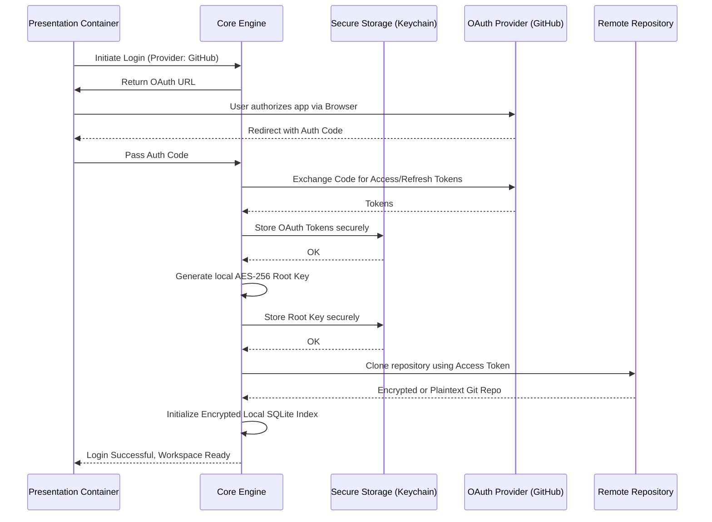

# Execution Flow: OAuth Handshake & Encryption Setup

**Maps to PRD Capability:** Users can authenticate via an OAuth provider... All local data is encrypted at rest. (Epic: Seamless Synchronization & Security, P0)

