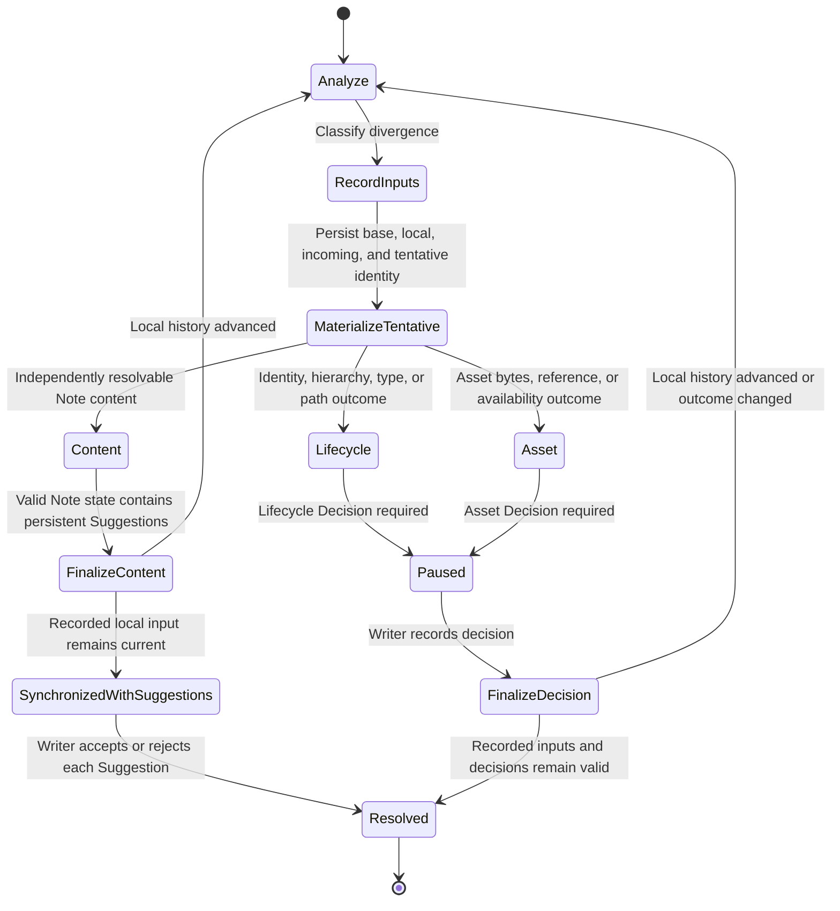

# Reconciliation flow

**Maps to:** CAP-SYNC-04, CAP-SYNC-10, CAP-SYNC-11, CAP-SYNC-13.

Delete-versus-edit follows the content path. burlmd restores the edited Note as a Suggestion and requires confirmation before deletion wins.

## Failure path

- Reconciliation records preserve base, local, incoming, tentative, and Writer-decision state before input is accepted.
- Crash recovery resumes from the record.
- Finalization fails closed when local state advanced and requires renewed input for changed outcomes.
- Raw conflict markers never become the user-facing or authoritative resolution model.
