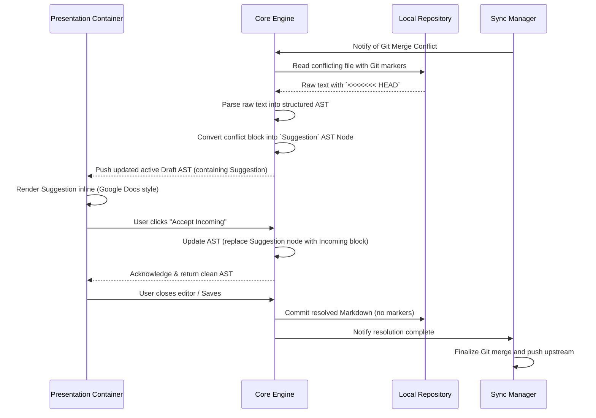

# Execution Flow: Conflict Resolution

**Maps to PRD Capability:** The system surfaces concurrent offline edits as inline Suggestions for the user to accept or reject. (Epic: Seamless Synchronization & Security, P1)

