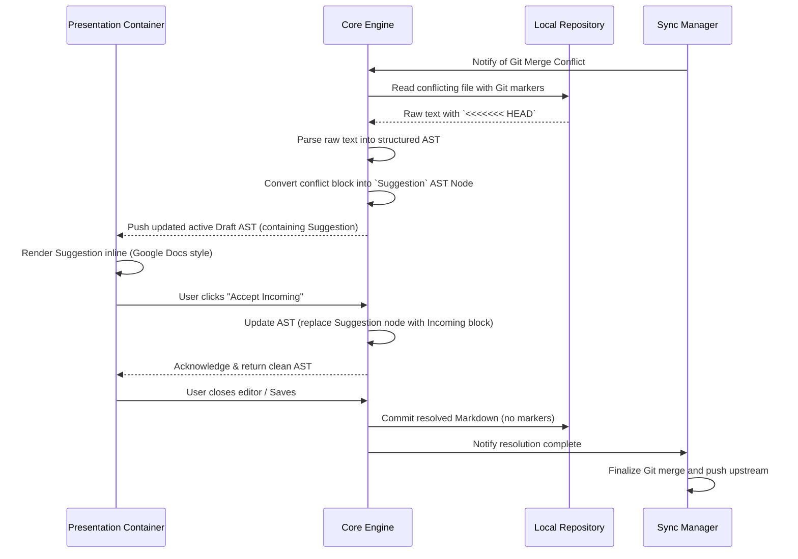

# Execution Flow: Conflict Resolution

**Maps to PRD Capability:** CAP-SYNC-04 (concurrent edits to the same Note surface inline as a Suggestion the user can accept or reject, never as raw conflict markers and never by duplicating the Note). Epic: Synchronization & Conflict Resolution, P1.

> **Status:** the body below predates ADR-006 and ADR-007 — it still describes pushing an "active Draft AST" and a "User closes editor / Saves" step, neither of which survives the raw-on-focus editing model or the single-writer working source. Deferred to Epic H, which owns the Suggestion surface and will revise it against the current contract.

