# Desktop session flow

**Maps to:** CAP-PREF-01, CAP-SHELL-02, CAP-SHELL-03, CAP-SHELL-04, CAP-SHELL-05, CAP-SHELL-06, CAP-SHELL-07, CAP-SHELL-08.

```mermaid
stateDiagram-v2
    [*] --> Restore
    Restore --> Active: Workspace and session state available
    Restore --> ChooseWorkspace: No restorable Workspace
    ChooseWorkspace --> Active: Open Workspace succeeds
    Active --> Active: Device preference persists outside Workspace
    Active --> Closing: Close tab, switch Workspace, or exit
    Closing --> Active: Clean close; continue serial batch
    Closing --> Partial: Session retired with degraded durability
    Closing --> Partial: Close failure
    Partial --> Active: Preserve unprocessed sessions
    Closing --> [*]: Orderly exit completes
```

The Host Platform owns window chrome throughout this flow. Device preferences and per-Workspace session state use separate durable scopes.

## Failure path

- A degraded-durability warning removes the retired tab, reports the warning, stops the batch, and cancels a switch or exit.
- A close failure keeps the failed and unprocessed tabs open, reports partial progress, and cancels a switch or exit.
- After an active-tab close, Presentation selects the following tab or the preceding tab when needed.
- Missing restored Notes are reported and skipped without blocking startup.
