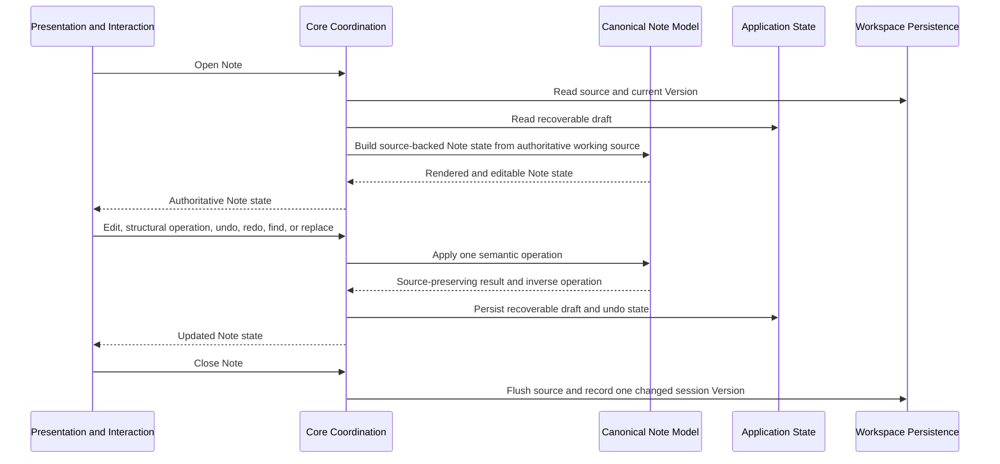

# Edit Note flow

**Maps to delivered:** CAP-EDIT-01, CAP-EDIT-02, CAP-EDIT-03, CAP-EDIT-04, CAP-EDIT-05, CAP-WS-02, CAP-WS-03.

**Maps to active:** CAP-EDIT-08, CAP-FIND-03.

## Failure path

- If draft persistence fails, Core reports unwritten state and doesn't claim durability.
- If the source revision changed, Core preserves the draft and routes the candidate disk change through the guest-change flow.
- Replace-all applies as one operation or leaves the Note unchanged.
- A close warning or failure follows the desktop-session flow.
