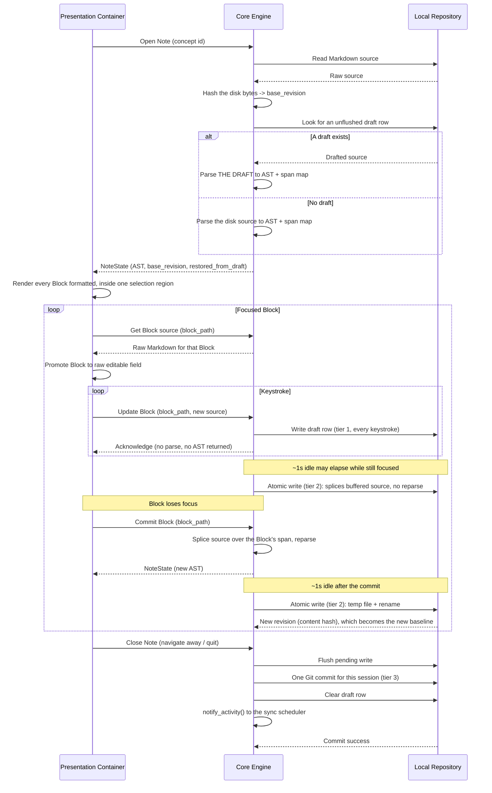

# Execution Flow: Edit Note

**Maps to PRD Capability:** CAP-EDIT-01 (the focused Block shows raw Markdown source while every other Block renders formatted), CAP-EDIT-03 (create, split, merge and delete Blocks through ordinary typing), CAP-WS-02 (every editing session captured in local version history), CAP-WS-03 (in-progress edits survive abrupt termination).

## Opening a Note with a recovered draft parses the draft

The branch in the open sequence is load-bearing, not presentational. A draft row exists precisely when its content differs from disk, so parsing the disk bytes and *then* reporting that a draft was restored would return an AST of the wrong document — and, worse, build the Core-side span map against bytes that are not the working source, so the first `commit_block` after a recovery would splice at offsets derived from a different file.

The working source is therefore whichever of the two is authoritative, while `base_revision` stays the hash of what is **on disk**, because that is what the tier 2 write must compare against before overwriting it. The two are deliberately drawn from different places, and this is what `SHEL-E007`'s "shows the drafted content rather than the last content written to disk" criterion actually requires.

## The save phase is a splice, not a serialization

The previous version of this flow specified "Serialize final AST back to Markdown" — a phase that was never implemented, and that could not be implemented without first inventing a canonical Markdown form (bullet character, emphasis delimiter, heading style, wrap policy) that nothing ever specified.

`prd/constraints.md`'s Edit Fidelity constraint makes that approach unusable regardless: writing a Note must leave every byte the user did not edit identical, and an AST-to-Markdown serializer rewrites the whole file by definition. Since CAP-EDIT-01 made editing *raw*, the editor already holds exactly the bytes belonging in the edited Block's span, so the save phase reduces to replacing those bytes. Nothing is reconstructed. See `tech-spec/adrs/ADR-007-span-preserving-splice-edits.md`.

## Why three write tiers rather than one

Draft rows absorb crash durability, so file writes need not be per-keystroke; file writes make the bundle correct on disk, so commits need not be per-write. The commit boundary is the editing *session* — closing the Note — rather than a timer, so that version history reads as one entry per Note per sitting instead of arbitrary time slices splitting a single thought. The accepted cost is that a Note left open for hours is written but uncommitted, and therefore unpushed, for hours. See `tech-spec/adrs/ADR-008-save-and-commit-granularity.md`.

## Nothing parses on the typing path

The keystroke loop above deliberately does not reparse and does not return an AST. While a Block is focused it displays raw source the Presentation Container already holds — the text the user just typed — and no other Block's rendering can change, so a per-keystroke AST would tell the caller nothing. The splice and reparse happen once, when the Block loses focus.

This matters because the alternative is not merely wasteful: a whole-file reparse plus an encrypted draft write plus a full-AST payload, on a synchronous FFI call, is exactly the composition that would blow the 16ms budget in `prd/constraints.md`. An earlier draft of this flow placed the reparse inside the keystroke loop, contradicting `risks.md` risk 7 and both ADR-007 and ADR-008, all three of which claim the tiering keeps reparse off the typing path.

## `block_path` is not stable across a commit

A splice can change a Block's node shape — a paragraph that gains a leading `- ` reparses as a list. The Presentation Container must therefore re-derive focus from the returned `NoteState` rather than retaining a path across a mutation. This is a real constraint on the UI, not an implementation detail.
