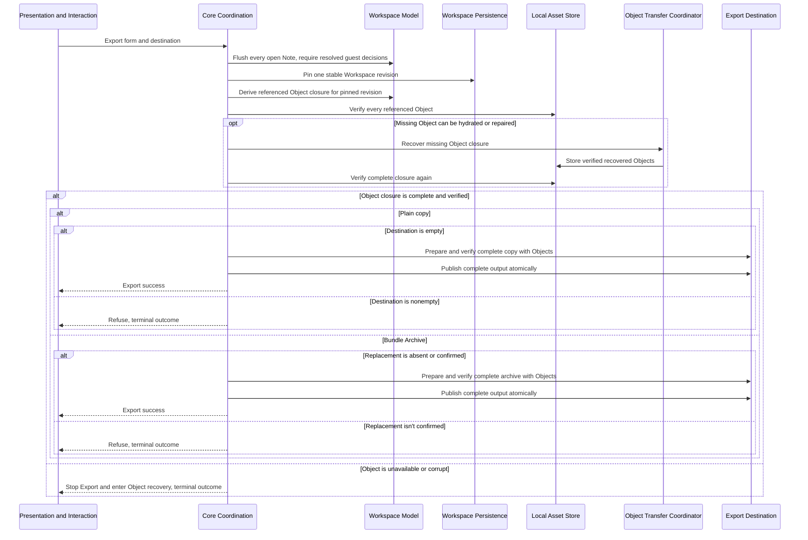

# Workspace Export flow

**Maps to:** CAP-PORT-02, CAP-PORT-06, CAP-PORT-07, CAP-PORT-08.

## Failure path

- A flush failure or unresolved guest decision stops Export before revision capture.
- A read, write, or verification failure removes temporary output and doesn't expose partial success.
- A missing or corrupt Object stops publication and enters Object recovery.
- Foreign nonconforming content remains byte-preserved in Export and is reported rather than silently repaired.
