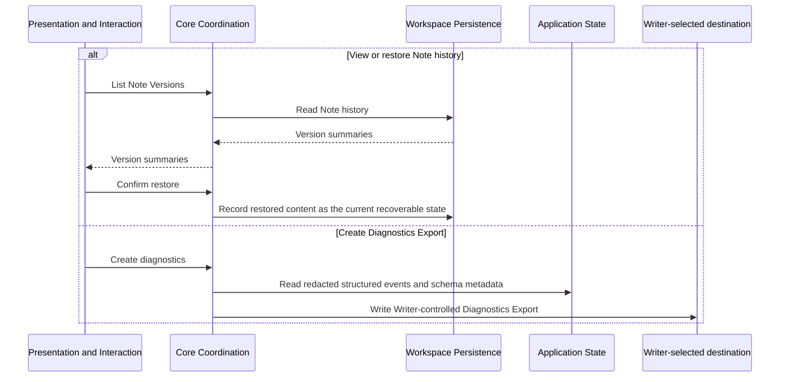

# History, recovery, and diagnostics flow

**Maps to:** CAP-HIST-01, CAP-SUP-01.

## Failure path

- Restore never discards unwritten work without confirmation and a durability transition.
- Missing historical Objects route through Object recovery before restored content becomes authoritative.
- Diagnostics generation fails rather than including Note bytes, Asset bytes, credentials, or signed locations.
