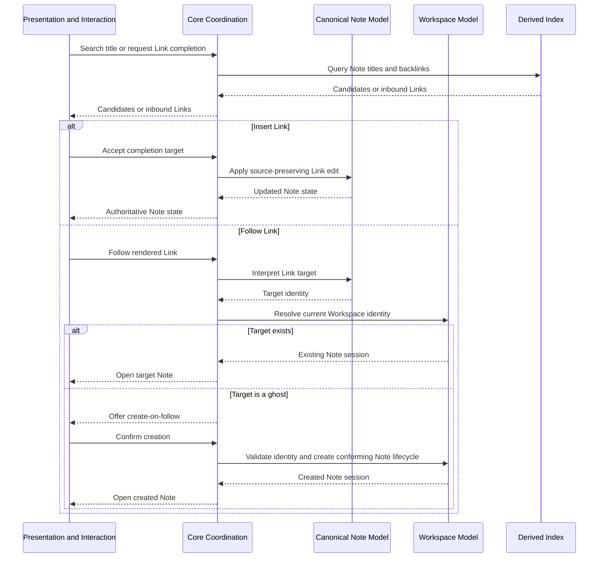

# Link graph flow

**Maps to delivered:** CAP-GRAPH-02, CAP-GRAPH-03, CAP-GRAPH-04.

**Maps to active:** CAP-FIND-02, CAP-GRAPH-05.

## Failure path

- No title match or backlink is an explicit empty state.
- A target collision that appears before create-on-follow is refused without changing the Link.
- An unavailable index degrades graph search but doesn't block opening a known Note path.
