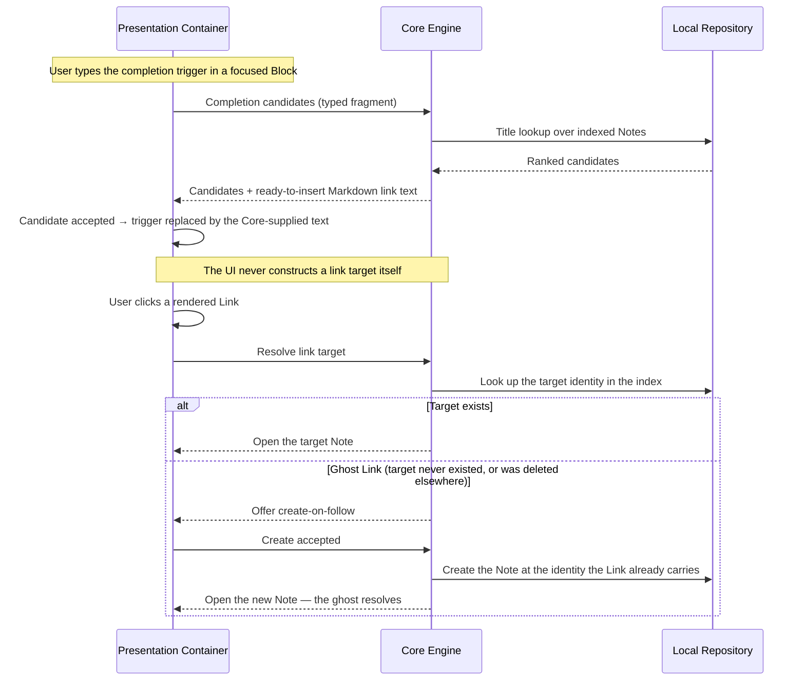

# Execution Flow: Link Insertion & Following

**Maps to PRD Capability:** CAP-GRAPH-02 (insert a Link through in-editor completion), CAP-GRAPH-03 (follow a Link from a rendered Block to open its target), CAP-GRAPH-04 (create a Link to a nonexistent Note and create that Note by following it).

## The trigger is an affordance, not a format

The double-bracket sequence exists only in the editor surface. What gets stored is a standard bundle-absolute Markdown link, because only standard syntax is traversable by the Automated Consumer actor — the entire reason on-disk conformance was adopted (`out-of-scope/wikilink-syntax-on-disk.md`).

## Why create-on-follow re-resolves instead of trusting cached state

Whether a Link resolves goes stale the moment any other Note is created or deleted — possibly on another device, surfaced here by an external-tool write or a sync pull. The follow path therefore checks the index at click time rather than trusting a flag recorded when the Block rendered:

- **Ghost whose target appeared meanwhile:** opens the existing Note; creating would collide and be refused.
- **Resolving Link whose target vanished meanwhile:** offers create-on-follow rather than a dead end.

## Failure path

- **Completion finds no candidates:** an empty list, not an error; dismissal leaves the typed text untouched.
- **Create-on-follow hits an unavailable path** (collision appeared since the check): the same refusal as ordinary creation surfaces, and the Link stays a ghost — honest, and consistent with `flow-note-lifecycle.md`'s refusal rules.
- **Multi-word or entity-bearing titles:** the Core derives the stored destination form so it parses back to the same identity; a title the derivation cannot invert is refused at creation time upstream, not discovered here.
