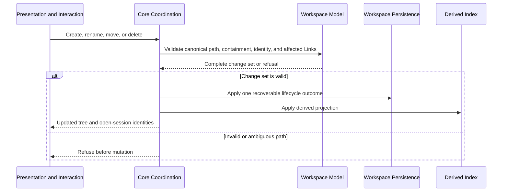

# Note and Directory lifecycle flow

**Maps to delivered:** CAP-LIFE-01, CAP-LIFE-02, CAP-LIFE-03, CAP-LIFE-04, CAP-LIFE-05, CAP-LIFE-06, CAP-PORT-01.

**Maps to active:** CAP-PORT-05.

## Failure path

- A path collision, unsupported indirection, or containment escape fails before mutation.
- A mid-operation failure restores the earlier files, Link text, open-session state, and derived projection.
- Delete remains recoverable through local history and isn't an undo operation.
