# Object Store lifecycle flow

**Maps to:** CAP-ASSET-03, CAP-ASSET-04, CAP-ASSET-05, CAP-ASSET-06, CAP-ASSET-08, CAP-ASSET-11, CAP-ASSET-12.

```mermaid
stateDiagram-v2
    [*] --> FullyLocal
    FullyLocal --> ValidateLocalStore: Connect Object Store
    ValidateLocalStore --> LocalWithObjectStore: Private access and required operations verified
    ValidateLocalStore --> FullyLocal: Validation fails
    FullyLocal --> RemoteWithoutObjectStore: Asset-free Remote connects
    LocalWithObjectStore --> RemoteWithObjectStore: Remote connects or exact prior Remote reconnects
    RemoteWithObjectStore --> LocalWithObjectStore: Offline Remote detach retains Object Store
    RemoteWithObjectStore --> HydratingRemote: Join or restore needs Objects
    HydratingRemote --> RemoteWithObjectStore: Active Objects first; remaining current state verified
    RemoteWithObjectStore --> RemoteAssetRecovery: Missing or corrupt Object pauses affected synchronization
    RemoteWithObjectStore --> PausedObjectPrivacy: Scheduled or prepublication privacy probe is stale or fails
    PausedObjectPrivacy --> RemoteWithObjectStore: Fresh probe disproves anonymous read
    LocalWithObjectStore --> LocalAssetRecovery: Missing or corrupt Object needs recovery
    HydratingRemote --> RemoteAssetRecovery: Identity verification fails
    RemoteAssetRecovery --> RemoteWithObjectStore: Repair, replacement, or reference removal verifies
    RemoteAssetRecovery --> RemoteAssetRecovery: Retry remains unresolved
    LocalAssetRecovery --> LocalWithObjectStore: Repair, replacement, or reference removal verifies
    LocalAssetRecovery --> LocalAssetRecovery: Retry remains unresolved
    RemoteWithObjectStore --> ValidateReplacementStore: Writer requests replacement store
    ValidateReplacementStore --> MigratingRemoteStore: Replacement privacy and operations verified; publish intent
    ValidateReplacementStore --> RemoteWithObjectStore: Validation fails before copy
    MigratingRemoteStore --> PausedMigrationPrivacy: Replacement privacy probe fails or expires
    PausedMigrationPrivacy --> MigratingRemoteStore: Fresh replacement validation succeeds
    MigratingRemoteStore --> RemoteWithObjectStore: Complete migration or keep earlier store after failure
    LocalWithObjectStore --> ValidateLocalReplacementStore: Replace before any Remote attachment
    ValidateLocalReplacementStore --> MigratingLocalStore: Replacement privacy and operations verified
    ValidateLocalReplacementStore --> LocalWithObjectStore: Validation fails before copy
    MigratingLocalStore --> PausedLocalMigrationPrivacy: Replacement privacy probe fails or expires
    PausedLocalMigrationPrivacy --> MigratingLocalStore: Fresh replacement validation succeeds
    MigratingLocalStore --> LocalWithObjectStore: Complete migration or keep earlier store after failure
    RemoteWithObjectStore --> DetachUnusedStore: Writer requests Object Store-only detach
    DetachUnusedStore --> RemoteWithoutObjectStore: Complete protected set is empty; Object Store detaches and Remote remains
    DetachUnusedStore --> RemoteWithObjectStore: Any protected reference exists or enumeration is stale/incomplete
    RemoteWithoutObjectStore --> ValidateRemoteStore: Writer reconnects an Object Store
    ValidateRemoteStore --> RemoteWithObjectStore: Private access and required operations verified
    ValidateRemoteStore --> RemoteWithoutObjectStore: Validation fails
    RemoteWithoutObjectStore --> FullyLocal: Writer detaches the Remote
    RemoteWithObjectStore --> RevalidatingRemote: Return Workspace to fully local
    RevalidatingRemote --> Detaching: Fresh published refs and protected closure verified
    RevalidatingRemote --> RemoteWithObjectStore: Offline, unauthorized, incomplete, or stale
    Detaching --> FullyLocal: Every Protected State hydrated; Object Store and Remote detach
    Detaching --> RemoteWithObjectStore: Bound revision advances before atomic detach
```

## Failure path

- Any anonymous list, read, write, or delete permission—or unknown privacy—refuses connection. While synchronized, all four permissions are revalidated on startup, before publication batches, and periodically; stale or failed evidence pauses Object transfer and history publication while local work remains available.
- Credential rotation validates replacements before removing earlier local credentials.
- Missing or corrupt bytes never become visible before identity verification. Asset Recovery preserves every verified copy and exposes only valid recovery actions.
- Cache eviction requires a verified Object Store copy and 30 days without use. burlmd doesn't delete authoritative Object Store bytes during `0.x`.
- An asset-bearing Workspace never remains Remote-connected without a verified Object Store.
- A Remote-connected Workspace with no protected Object references may detach only the Object Store after complete current, local-history, published-history, pending-reconciliation, and Consolidation enumeration proves the protected set empty. The Remote remains attached.
- Offline Remote detachment moves `RemoteWithObjectStore` to `LocalWithObjectStore`; it removes local Remote attachment state and retains the Object Store. The Writer must reconnect the exact prior Remote before a full-local transition. That transition requires authenticated online enumeration of every published Remote ref immediately before Protected Object hydration, consumes readiness bound to that ref inventory and the Workspace revision, and refuses if either advances before atomic detach.
- Replacing the store for a connected Workspace first passes the complete private-store validation boundary, then publishes a durable migration intent. Replacement privacy is revalidated periodically and before publication throughout baseline copy, delta reconciliation, and dual writes; failure pauses migration and publication with the old store authoritative and local work available. Every publisher dual-writes until baseline and delta reconciliation reach the bound Workspace and Remote inventories. Cutover retains a non-secret descriptor for the old store. On a replacement miss, securely supplied old-store credentials or a credentialed peer recover and content-verify the Object, backfill and verify the replacement, and only then hydrate the requester. A Remote-detached Workspace that previously published must reconnect before replacement migration.
