# Object Store lifecycle flow

**Maps to:** CAP-ASSET-03, CAP-ASSET-04, CAP-ASSET-05, CAP-ASSET-06, CAP-ASSET-07, CAP-ASSET-08, CAP-ASSET-11, CAP-ASSET-12.

```mermaid
stateDiagram-v2
    [*] --> LocalOnly
    LocalOnly --> Validate: Connect Object Store
    Validate --> Connected: Private access and required operations verified
    Validate --> LocalOnly: Validation fails
    Connected --> Hydrating: Join or restore needs Objects
    Hydrating --> Connected: Active Objects first; remaining current state verified
    Connected --> AssetRecovery: Missing or corrupt Object pauses affected synchronization
    Hydrating --> AssetRecovery: Identity verification fails
    AssetRecovery --> Connected: Repair, replacement, or reference removal completes and verifies
    AssetRecovery --> AssetRecovery: Retry remains unresolved
    Connected --> Migrating: Replace Object Store
    Migrating --> Connected: Complete verified migration
    Migrating --> Connected: Failure keeps earlier store active
    Connected --> DetachUnusedStore: Writer requests Object Store-only detach
    DetachUnusedStore --> RemoteWithoutObjectStore: Complete protected set is empty; Object Store detaches and Remote remains
    DetachUnusedStore --> Connected: Any protected reference exists or enumeration is stale/incomplete
    RemoteWithoutObjectStore --> Validate: Writer reconnects an Object Store
    RemoteWithoutObjectStore --> LocalOnly: Writer separately detaches the Remote
    Connected --> Detaching: Return Workspace to fully local
    Detaching --> LocalOnly: Every Protected State hydrated; Object Store and Remote detach
    Detaching --> Connected: Hydration incomplete
```

## Failure path

- Anonymous readability or unknown privacy refuses connection.
- Credential rotation validates replacements before removing earlier local credentials.
- Missing or corrupt bytes never become visible before identity verification. Asset Recovery preserves every verified copy and exposes only valid recovery actions.
- Cache eviction requires a verified Object Store copy. Authoritative deletion also requires 30 days of unreachability and complete published-history enumeration.
- An asset-bearing Workspace never remains Remote-connected without a verified Object Store.
- A Remote-connected Workspace with no protected Object references may detach only the Object Store after complete current, local-history, published-history, pending-reconciliation, and Consolidation enumeration proves the protected set empty. The Remote remains attached.
