# Object Store lifecycle flow

**Maps to:** CAP-ASSET-03, CAP-ASSET-04, CAP-ASSET-05, CAP-ASSET-06, CAP-ASSET-08, CAP-ASSET-11, CAP-ASSET-12.

```mermaid
stateDiagram-v2
    [*] --> FullyLocal
    FullyLocal --> ValidateLocalStore: Connect Object Store
    ValidateLocalStore --> LocalWithObjectStore: Private access and required operations verified
    ValidateLocalStore --> FullyLocal: Validation fails
    FullyLocal --> RemoteWithoutObjectStore: Asset-free Remote connects
    LocalWithObjectStore --> RemoteWithObjectStore: Remote connects
    RemoteWithObjectStore --> LocalWithObjectStore: Offline Remote detach retains Object Store
    LocalWithObjectStore --> HydratingForStoreDetach: Remove retained Object Store
    HydratingForStoreDetach --> FullyLocal: Every local Protected Object verified; Object Store detaches
    HydratingForStoreDetach --> LocalWithObjectStore: Hydration incomplete or revision advances
    RemoteWithObjectStore --> HydratingRemote: Join or restore needs Objects
    HydratingRemote --> RemoteWithObjectStore: Active Objects first; remaining current state verified
    RemoteWithObjectStore --> RemoteAssetRecovery: Missing or corrupt Object pauses affected synchronization
    LocalWithObjectStore --> LocalAssetRecovery: Missing or corrupt Object needs recovery
    HydratingRemote --> RemoteAssetRecovery: Identity verification fails
    RemoteAssetRecovery --> RemoteWithObjectStore: Repair, replacement, or reference removal verifies
    RemoteAssetRecovery --> RemoteAssetRecovery: Retry remains unresolved
    LocalAssetRecovery --> LocalWithObjectStore: Repair, replacement, or reference removal verifies
    LocalAssetRecovery --> LocalAssetRecovery: Retry remains unresolved
    RemoteWithObjectStore --> MigratingRemoteStore: Publish migration intent; begin dual write
    MigratingRemoteStore --> RemoteWithObjectStore: Complete migration or keep earlier store after failure
    LocalWithObjectStore --> MigratingLocalStore: Replace before any Remote attachment
    MigratingLocalStore --> LocalWithObjectStore: Complete migration or keep earlier store after failure
    RemoteWithObjectStore --> DetachUnusedStore: Writer requests Object Store-only detach
    DetachUnusedStore --> RemoteWithoutObjectStore: Complete protected set is empty; Object Store detaches and Remote remains
    DetachUnusedStore --> RemoteWithObjectStore: Any protected reference exists or enumeration is stale/incomplete
    RemoteWithoutObjectStore --> ValidateRemoteStore: Writer reconnects an Object Store
    ValidateRemoteStore --> RemoteWithObjectStore: Private access and required operations verified
    ValidateRemoteStore --> RemoteWithoutObjectStore: Validation fails
    RemoteWithoutObjectStore --> FullyLocal: Writer detaches the Remote
    RemoteWithObjectStore --> RevalidatingRemote: Return Workspace to fully local
    RevalidatingRemote --> Detaching: Fresh published refs and protected closure verified
    RevalidatingRemote --> RemoteWithObjectStore: Offline, unauthorized, incomplete, or stale
    Detaching --> FullyLocal: Every Protected State hydrated; Object Store and Remote detach
    Detaching --> RemoteWithObjectStore: Bound revision advances before atomic detach
```

## Failure path

- Anonymous readability or unknown privacy refuses connection.
- Credential rotation validates replacements before removing earlier local credentials.
- Missing or corrupt bytes never become visible before identity verification. Asset Recovery preserves every verified copy and exposes only valid recovery actions.
- Cache eviction requires a verified Object Store copy and 30 days without use. burlmd doesn't delete authoritative Object Store bytes during `0.x`.
- An asset-bearing Workspace never remains Remote-connected without a verified Object Store.
- A Remote-connected Workspace with no protected Object references may detach only the Object Store after complete current, local-history, published-history, pending-reconciliation, and Consolidation enumeration proves the protected set empty. The Remote remains attached.
- Offline Remote detachment moves `RemoteWithObjectStore` to `LocalWithObjectStore`; it removes local Remote attachment state and retains the Object Store. The Writer can reconnect the Remote or hydrate every locally protected Object before removing the retained Object Store. A full-local transition from an attached Remote requires authenticated online enumeration of every published Remote ref immediately before Protected Object hydration. The transition consumes a readiness result bound to that ref inventory and the Workspace revision, and refuses if either advances before atomic detach.
- Replacing the store for a connected Workspace publishes a durable migration intent. Every publisher dual-writes until baseline and delta reconciliation reach the bound Workspace and Remote inventories. Cutover retains a non-secret descriptor for the old store. On a replacement miss, securely supplied old-store credentials or a credentialed peer recover and content-verify the Object, backfill and verify the replacement, and only then hydrate the requester. A Remote-detached Workspace that previously published must reconnect before replacement migration; it can instead hydrate locally and remove the retained store.
