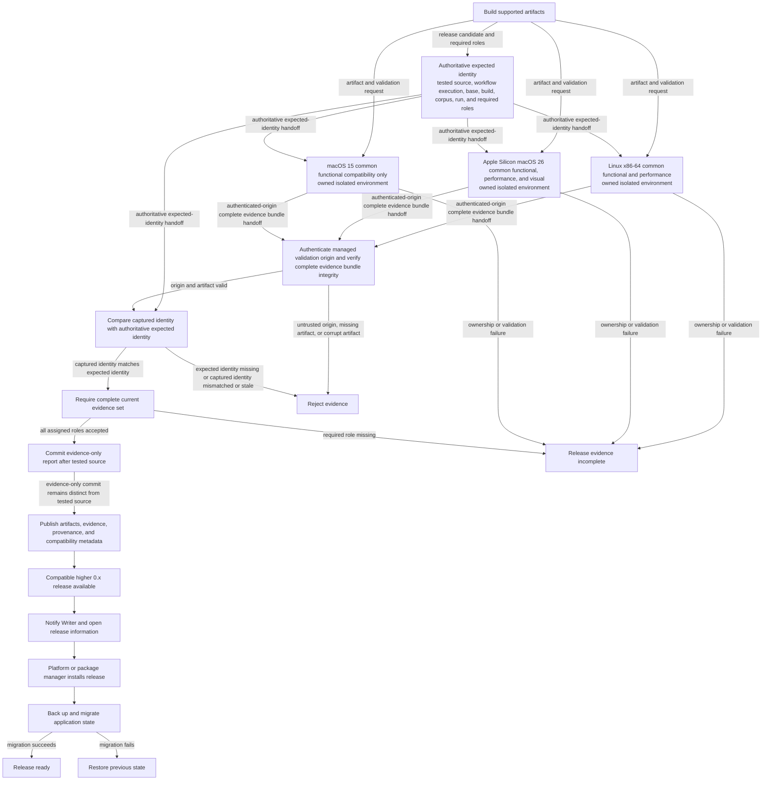

# Release and upgrade flow

**Maps to:** CAP-REL-01, CAP-REL-02, CAP-REL-03, CAP-REL-04, CAP-REL-05, CAP-REL-06.

## Failure path

- Every validation environment owns its display, compositor, input, and process state. If ownership isn't proven, it produces no acceptable evidence.
- The Writer's active desktop never supplies visual proof. The Writer's desktop state in a capture invalidates the complete run.
- Missing authoritative tested-source, workflow-execution, base, release, build, corpus, run, or required-role identity prevents evidence acceptance.
- An untrusted or unmanaged validation origin, an incomplete evidence bundle, or corrupt evidence fails verification before aggregation.
- Aggregation compares captured identity with the expected identity supplied directly by Release Pipeline. Self-description alone is insufficient.
- A captured identity that is mismatched or stale is rejected. Evidence from another run can't satisfy the current release gate.
- The later evidence-only report commit remains distinct from the tested source. A report commit that changes anything except evidence can't represent that run.
- All three roles must pass the common functional matrix. macOS 15 can't replace either performance role or the macOS 26 visual role.
- A launch-only result can't admit a system to the supported matrix.
- Update notification never replaces installed binaries.
- Unsigned prerelease status and Platform installation guidance remain explicit.
