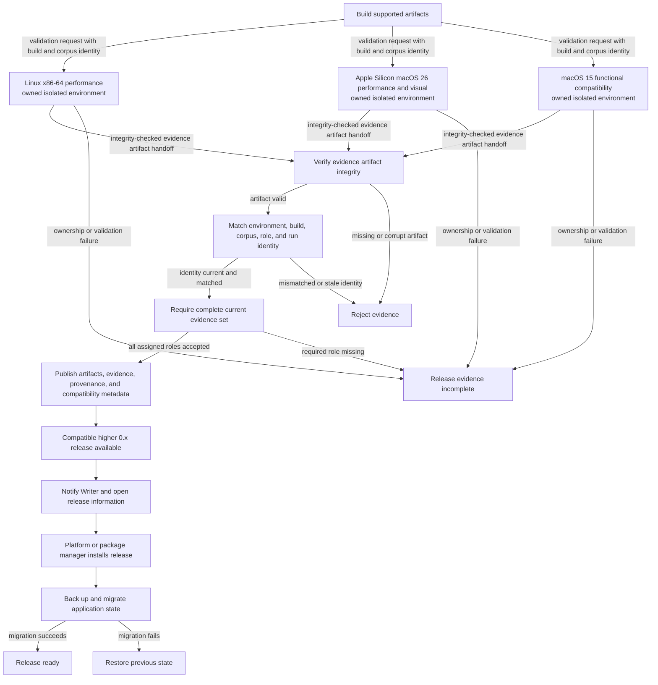

# Release and upgrade flow

**Maps to:** CAP-REL-01, CAP-REL-02, CAP-REL-03, CAP-REL-04, CAP-REL-05, CAP-REL-06.

## Failure path

- Every validation environment owns its display, compositor, input, and process state. If ownership isn't proven, it produces no acceptable evidence.
- The Writer's active desktop never supplies visual proof. The Writer's desktop state in a capture invalidates the complete run.
- Missing or corrupt evidence fails integrity verification before aggregation.
- Mismatched environment, build, corpus, role, or run identity is rejected. Stale evidence can't satisfy a current release gate.
- macOS 15 evidence can satisfy only functional compatibility. It can't replace either performance role or the macOS 26 visual role.
- A launch-only result can't admit a system to the supported matrix.
- Update notification never replaces installed binaries.
- Unsigned prerelease status and Platform installation guidance remain explicit.
