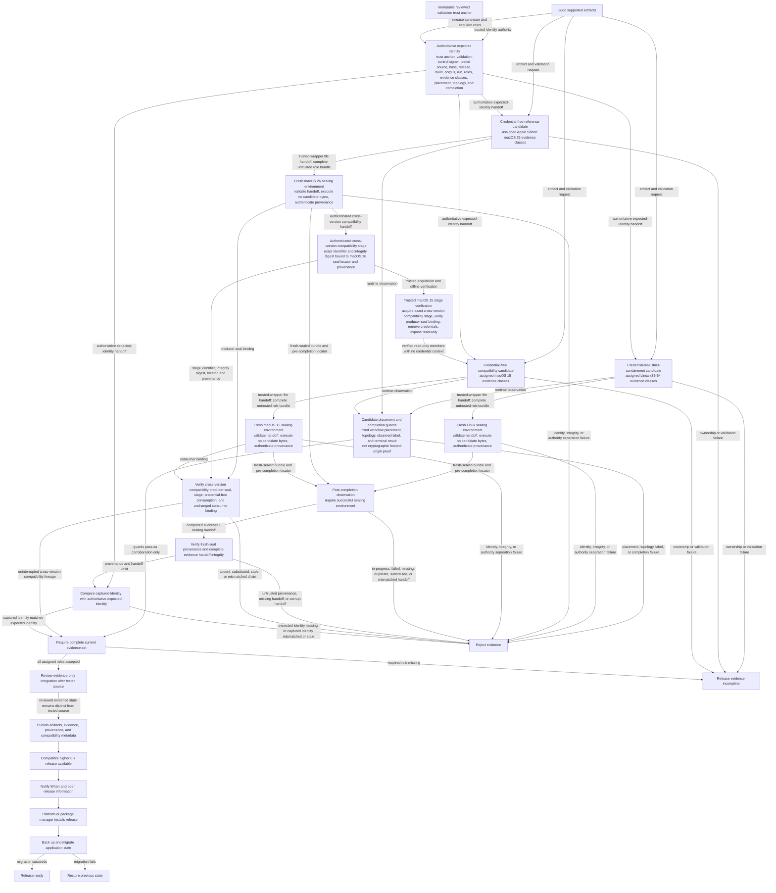

# Release and upgrade flow

**Maps to:** CAP-REL-01, CAP-REL-02, CAP-REL-03, CAP-REL-04, CAP-REL-05, CAP-REL-06.

## Failure path

- Every validation role owns its display, compositor, and input state. The strict-containment role proves candidate-process teardown before its trusted wrapper uploads the handoff. Other hosted roles record bounded cleanup and don't claim that arbitrary candidate processes ended. A missing assigned ownership, teardown, or cleanup result produces no acceptable evidence.
- The Writer's active device never supplies visual proof or validation input. Writer windows, desktop state, or active-device input in a capture invalidate the complete run.
- Missing authoritative trust-anchor, validation-control signer, tested-source, base, release, build, corpus, run, required-role, role-specific evidence-class, candidate-placement, topology, or completion expectation prevents evidence acceptance.
- A candidate-defined launcher, provenance control, expected identity, or change outside the declared write boundary prevents dispatch or evidence acceptance.
- Candidate commands are credential-free and receive no provenance authority. A trusted wrapper can upload the complete candidate bundle, but the file handoff remains untrusted. A candidate survivor can corrupt or deny that upload and fail the role. It can't enter a fresh sealing environment or gain its authority.
- Trusted workflow fixes candidate placement and topology. Runtime observations confirm the expected label and terminal result. These guards don't cryptographically prove hosted origin. A failed guard rejects the role, but a passing guard can't substitute for seal provenance.
- Each fresh sealing environment is the sole provenance and hosted-origin authority for its role. It never executes candidate bytes. It validates candidate-environment identity, exact inventory, and complete integrity before authenticating a sealed handoff. Fresh-seal provenance alone cryptographically authenticates the sealing environment's hosted origin. If that separation or validation can't be proved, evidence is rejected.
- For the cross-version compatibility handoff, the macOS 26 seal validates the producer members and creates the authenticated compatibility stage. It binds the exact stage identifier and integrity digest to its seal locator and provenance.
- The trusted macOS 15 wrapper acquires that exact stage and verifies its producer-seal binding before candidate execution. It removes the acquisition credential context and exposes verified members read-only. The candidate receives no credential or provenance authority.
- The macOS 15 seal validates the producer stage lineage against the trusted wrapper record and preserves it. Aggregation rejects any absent, duplicate, substituted, expired, integrity-mismatched, unauthenticated, wrong-producer, wrong-role, wrong-run, wrong-seal, or consumer-unbound stage.
- A sealing environment can't attest its own final result before it finishes. Aggregation must observe one completed successful sealing environment independently; an in-progress, failed, missing, duplicate, substituted, or role-inconsistent handoff prevents evidence acceptance.
- Validation bootstrap needs a reviewed implementation integration followed by a reviewed evidence-only integration. The validation capability remains incomplete between them.
- Untrusted or unmanaged sealing provenance, an incomplete evidence handoff, or corrupt evidence fails verification before aggregation.
- Candidate-controlled aggregation never shares the authenticated acquisition context. Missing coordinator identity, reachable credentials or user configuration, writable inputs, an extra writable filesystem boundary, or available network access rejects the run.
- Aggregation compares captured identity with the expected identity supplied directly by Release Pipeline. Self-description alone is insufficient. For the cross-version compatibility handoff, aggregation also verifies the uninterrupted producer-seal-to-consumer lineage.
- A captured identity that is mismatched or stale is rejected. Evidence from another run can't satisfy the current release gate.
- The later evidence commit remains distinct from the tested source. A commit that changes anything except declared evidence can't represent that run.
- Every role must pass exactly the evidence classes assigned by the current gate. An environment capability isn't required unless the gate assigns it. macOS 15 can't replace either performance role, Linux platform-regression evidence, or the macOS 26 authoritative product visual role.
- A launch-only result can't admit a system to the supported matrix.
- Update notification never replaces installed binaries.
- Unsigned prerelease status and Platform installation guidance remain explicit.
