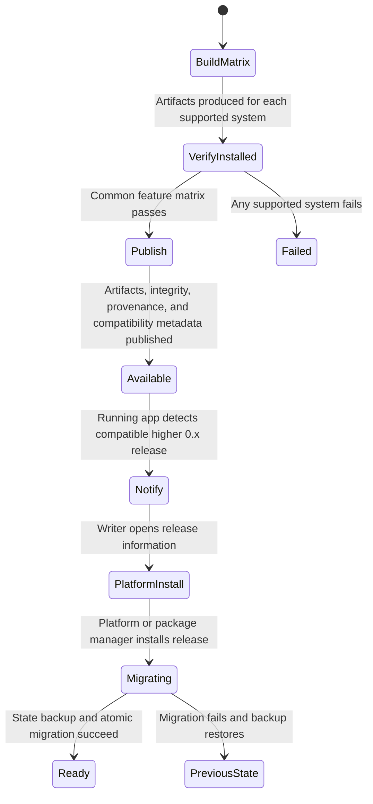

# Release and upgrade flow

**Maps to:** CAP-REL-01, CAP-REL-02, CAP-REL-03, CAP-REL-04, CAP-REL-05, CAP-REL-06.

## Failure path

- A launch-only result can't admit a system to the supported matrix.
- The Linux compatibility baseline remains provisional until OD-08 evidence is accepted upstream.
- Update notification never replaces installed binaries.
- Unsigned prerelease status and Platform installation guidance remain explicit.
