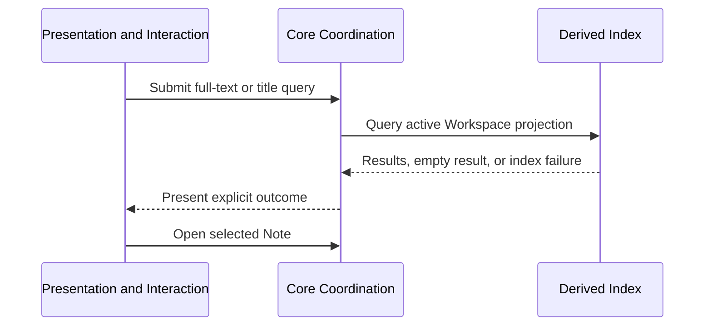

# Workspace search flow

**Maps to delivered:** CAP-FIND-01.

**Maps to active:** CAP-FIND-02.

## Failure path

- No matches produce an empty state, not an error.
- An unavailable index exposes rebuild or retry while open Notes remain readable and editable.
- Result truncation must be explicit to Presentation rather than silent.
