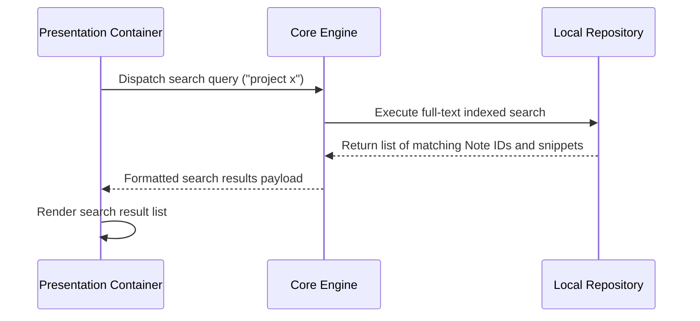

# Execution Flow: Instant Search

**Maps to PRD Capability:** Users can instantly search across all Notes in their Workspace. (Epic: Discovery & Retrieval, P0)

```mermaid
sequenceDiagram
    participant UI as Presentation Container
    participant Core as Core Engine
    participant Local as Local Repository

    UI->>Core: Dispatch search query ("project x")
    Core->>Local: Execute full-text indexed search
    Local-->>Core: Return list of matching Note IDs and snippets
    Core-->>UI: Formatted search results payload
    UI->>UI: Render search result list
```
