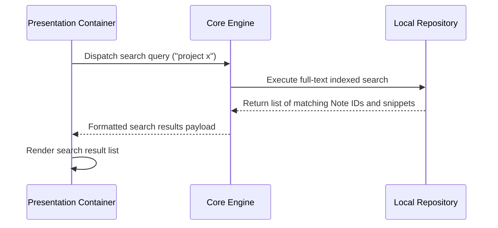

# Execution Flow: Instant Search

**Maps to PRD Capability:** CAP-FIND-01 (search the full text of every Note in the Workspace and open a result directly). Epic: Discovery & Retrieval, P0.

> **Amended for tech-spec v1.1.0.** Unlike the two sync flows, this one is built *this wave* — `WSPC-D009` and `SHEL-E006` — and the contract beneath it changed here: `search_notes` takes a caller-supplied `limit` replacing a hardcoded cap of 50 that truncated silently, it is scoped to the active Workspace by the Core rather than by a `workspace_id` parameter (contract rule 2), and `find_notes_by_title` now sits alongside it for CAP-FIND-02. The Workspace filter is not drawn as a step below because there is nothing for the caller to pass: it is ambient in the Core.

