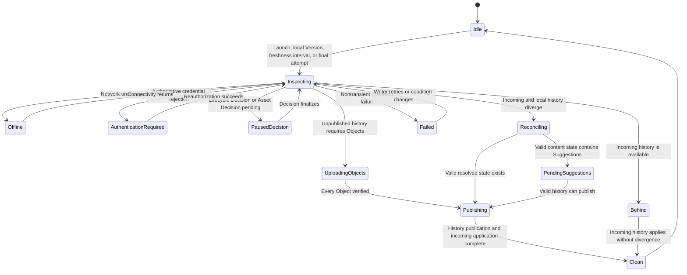

# Background synchronization flow

**Maps to:** CAP-SYNC-02, CAP-SYNC-03.

## Failure path

- Synchronization state remains explicit and never blocks local editing or history.
- The bounded shutdown attempt reports unfinished work and doesn't delay Platform shutdown indefinitely.
- Startup resumes durable intents, Object obligations, and reconciliation records idempotently.
- Pending Suggestions remain a distinct synchronized state and don't block valid history publication.
