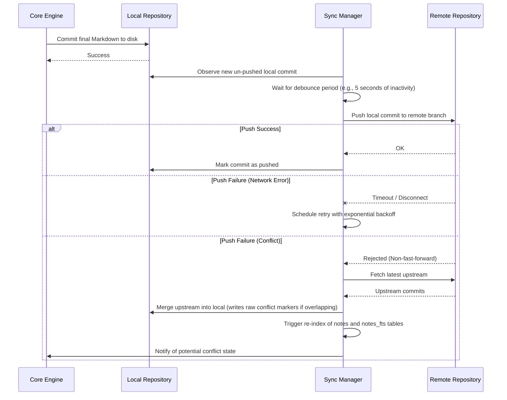

# Execution Flow: Background Sync

**Maps to PRD Capability:** CAP-SYNC-02 (once connected, the system automatically synchronizes changes with the Remote in the background without user action). Epic: Synchronization & Conflict Resolution, **P1**.

> **Status:** the body below predates PRD v1.1.0 and ADR-005/ADR-006. It is not updated here because the whole of synchronization is deferred to Epic G, which will revise it against the current contract; the header is corrected because it cited a P0 priority the PRD no longer assigns and an epic name that no longer exists.

