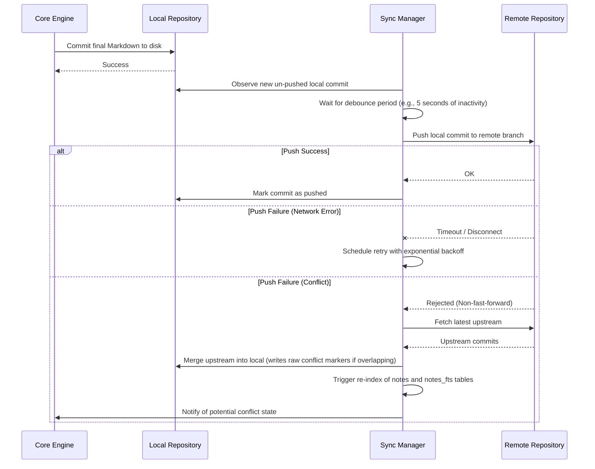

# Execution Flow: Background Sync

**Maps to PRD Capability:** The system continuously and automatically syncs changes across devices in the background. (Epic: Seamless Synchronization, P0)

```mermaid
sequenceDiagram
    participant Core as Core Engine
    participant Local as Local Repository
    participant Sync as Sync Manager
    participant Remote as Remote Repository

    Core->>Local: Commit final Markdown to disk
    Local-->>Core: Success
    
    Sync->>Local: Observe new un-pushed local commit
    Sync->>Sync: Wait for debounce period (e.g., 5 seconds of inactivity)
    
    Sync->>Remote: Push local commit to remote branch
    alt Push Success
        Remote-->>Sync: OK
        Sync->>Local: Mark commit as pushed
    else Push Failure (Network Error)
        Remote--xSync: Timeout / Disconnect
        Sync->>Sync: Schedule retry with exponential backoff
    else Push Failure (Conflict)
        Remote-->>Sync: Rejected (Non-fast-forward)
        Sync->>Remote: Fetch latest upstream
        Remote-->>Sync: Upstream commits
        Sync->>Local: Merge upstream into local (writes raw conflict markers if overlapping)
        Sync->>Sync: Trigger re-index of notes and notes_fts tables
        Sync->>Core: Notify of potential conflict state
    end
```
