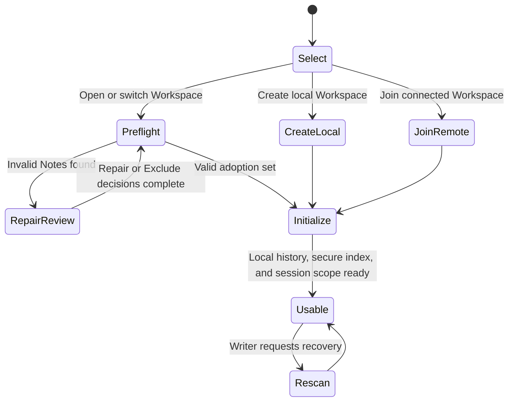

# Workspace bootstrap and adoption flow

**Maps to delivered:** CAP-WS-01, CAP-WS-04, CAP-WS-06.

**Maps to active:** CAP-WS-05, CAP-WS-13.

Every entry path converges on one active Workspace with local history, secure aggregate indexing, authority state, and per-Workspace session scope.

## Failure path

- Secure index setup failure never falls back to an unprotected aggregate index.
- Invalid Notes remain excluded and uneditable until previewed Repair or Exclude.
- A Workspace switch runs the desktop-session close flow before changing the active Workspace.
- Partial initialization is recoverable and doesn't rewrite guest Note bytes silently.
