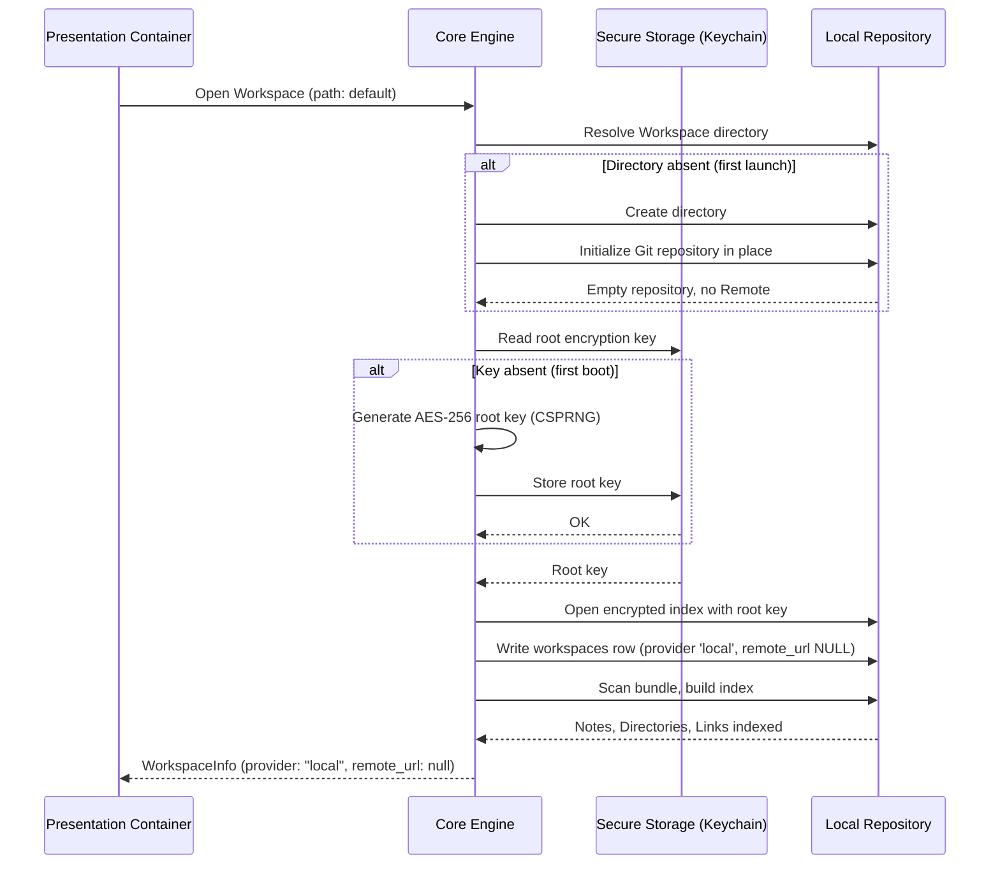

# Execution Flow: Workspace Bootstrap & Encryption Setup

**Maps to PRD Capability:** CAP-WS-01 (begin writing on first launch with no account, no provider authorization, and no network connection), CAP-WS-04 (local data protected at rest).

This flow contains no network step and no credential. That is the point: `prd/constraints.md`'s Local-First Mandate requires the application be fully functional disconnected, and this is the entire path from a cold start to a writable Workspace.

## Why the root key is generated here, not during authentication

`flow-auth-handshake.md` previously generated and stored the root encryption key as a step of the OAuth handshake. The two were only ever adjacent in the original sequence, never causally related: the key encrypts the *local* index, which exists whether or not a Remote is ever attached. Placing the key behind authentication meant an unauthenticated user had no index, and therefore no application — see `prd/out-of-scope/mandatory-account-on-first-run.md`. Bootstrap owns it now, unconditionally.

## Three bootstrap paths, one post-condition

A Workspace can also arrive by **clone**, when a user attaches an existing Remote on a second device, or by **adoption** — `open_workspace`, pointing the application at a directory it did not create (CAP-WS-05). All three must converge on identical post-conditions — index initialized, root key present, `workspaces` row written, bundle indexed, **repository present** — so that no later code needs to ask which path produced the Workspace it is looking at.

The last of those post-conditions is what makes adoption a real third path rather than a shortcut. Tier 3 makes a Git commit on every Note close, so a Workspace adopted from a directory with no history has nothing to commit into: `CAP-WS-02` would be unsatisfiable for every session in it and `close_note` would fail on the routine path. Adoption therefore initializes a repository when the directory has none, and adopts the existing history when it has one — see ADR-005 decision 8. Creating `.git/` in a directory the user pointed at is a real side effect, and the accepted one: the alternative is a Workspace that silently cannot keep history, discovered on the first close.

## Indexing cost

The scan step is bounded by `prd/constraints.md`'s Workspace Open Latency constraint: interaction must not block for more than 1 second regardless of Note count. For any Workspace large enough to exceed that, indexing continues incrementally in the background while the Workspace is already usable, per `risks.md` risk 3.
