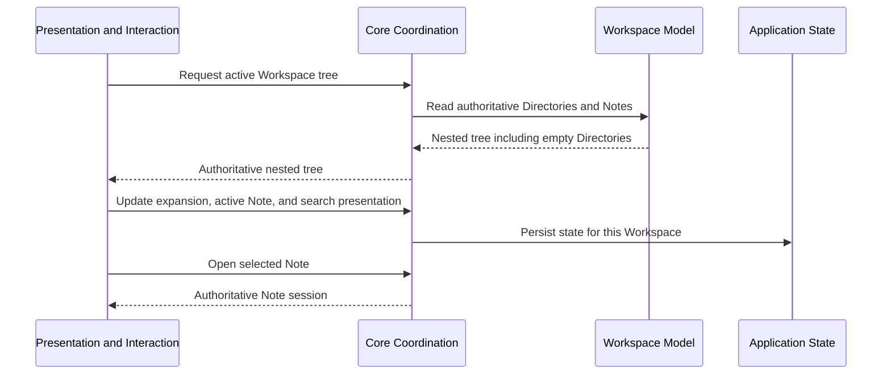

# Workspace navigation flow

**Maps to delivered:** CAP-GRAPH-01.

**Maps to active:** CAP-SHELL-03.

## Failure path

- A tree-projection failure leaves open Note sessions usable and offers retry.
- A missing selected Note reverts selection and reports the missing path.
- Guest or synchronized lifecycle changes refresh the authoritative tree through their owning flows.
