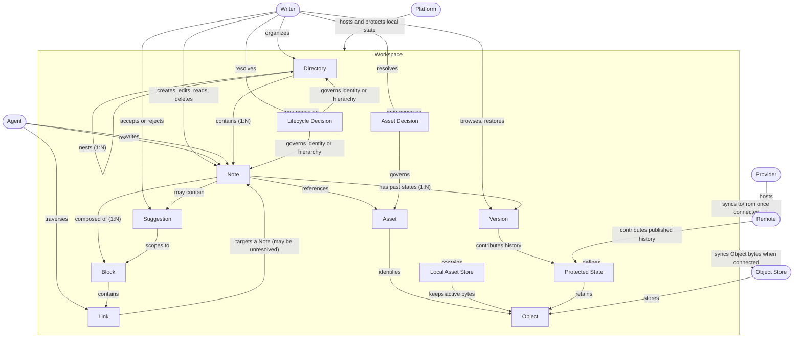

# Domain model

## Model rules

- A **Workspace** is complete without a **Remote**. The Remote is an optional connection that adds multi-device synchronization. Every other relationship in this diagram holds with no Remote present.
- A **Link** may target a Note that does not exist yet. Such a Link remains valid and traversable as an intent, and resolves once the target Note is created.
- A **Suggestion** can persist through history and Remote synchronization until the Writer accepts or rejects it.
- A **Lifecycle Decision** or **Asset Decision** pauses Workspace synchronization until the Writer resolves it. Local editing and history remain available.
- An **Asset** is a user-visible reference. An **Object** contains immutable bytes. The Local Asset Store keeps active Objects available offline, and an optional Object Store synchronizes Objects between devices.
- A **Protected State** includes current Workspace state, all retained or unpublished local history, all reachable published Remote history, pending reconciliation, and Consolidation. Every reachable Object remains authoritative.
- A **Version** is a past state of one Note, captured by local history. Versions make deletion recoverable and restore possible; they belong to the problem space because users reason about "what this Note looked like last Tuesday," not about repositories.
- The **Agent** can read or write the same on-disk Workspace that the Writer edits. The Agent must follow burlmd's published Workspace contract. Guest access doesn't transfer semantic authority away from burlmd.
