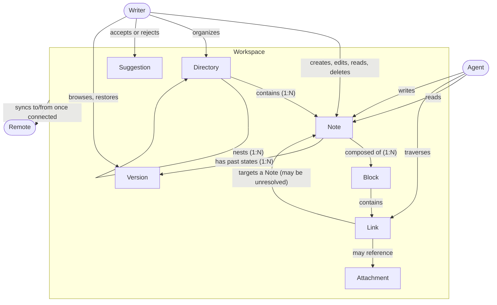

# Domain Model

## Notes on the model
- A **Workspace** is complete without a **Remote**. The Remote is an optional attachment that adds multi-device synchronization; every other relationship in this diagram holds with no Remote present.
- A **Link** may target a Note that does not exist yet. Such a Link remains valid and traversable as an intent, and resolves once the target Note is created.
- A **Suggestion** exists only transiently, between the discovery of concurrent edits and the user's decision. It is a state a Block can be in, not a separate stored artifact.
- An **Attachment** is non-Note content inside the Workspace, such as an image a Note references. It lives apart from Notes so the two kinds never share a namespace, and it is never indexed as a Note.
- A **Version** is a past state of one Note, captured by local history. Versions make deletion recoverable and restore possible; they belong to the problem space because users reason about "what this Note looked like last Tuesday," not about repositories.
- The **Agent** reads — and may write — the same on-disk Workspace the Writer edits, with no export, API, or running application in between. This is why on-disk format conformance is a continuous requirement rather than a feature of an export path.
