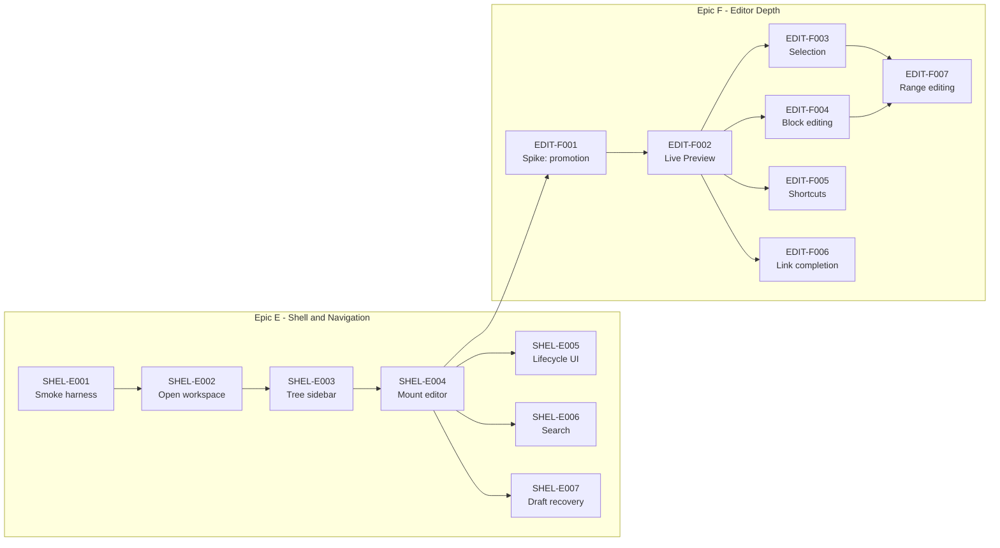

# Active Backlog Summary

**Total Active Story Points:** 55

- Epic E — Shell & Navigation: 25
- Epic F — Editor Depth: 30

Epics A, B, C and D (99 points — 10, 23, 16 and 50, summed from the ticket efforts in `completed/`) are complete and archived under `completed/`; they contribute nothing to the totals or the graph below.

Epic D is what changed between v1.4.0 and this revision. The Core is now real: a bundle on disk, an encrypted index derived from it, span-preserving editing that never rewrites a byte the user did not touch, the four persistence tiers, and Note and Directory lifecycle with atomic inbound-link rewriting. The claim that opened the previous revision — that every production `INSERT` in the repository lives inside a test module — is no longer true. What remains true is the other half: the application still opens to a login screen that cannot be passed, and nothing built in Epic D is reachable from it. **Everything left in this wave is user-facing.** That is a different kind of work from what just shipped, and it is worth naming, because the remaining 55 points carry all of the product risk and none of the algorithmic risk.

## Critical Path

The longest dependency chain is **33 of the 55 points**. Everything else can be scheduled around it.

1. `SHEL-E001` — Manual-QA Smoke Harness
2. `SHEL-E002` — Open Directly Into the Workspace
3. `SHEL-E003` — Directory Tree Sidebar
4. `SHEL-E004` — Mount the Editor and Navigate
5. `EDIT-F001` — Spike: Rendered-to-Raw Promotion Fidelity
6. `EDIT-F002` — Live Preview Block Promotion
7. `EDIT-F003` — Cross-Block Selection and Copy
8. `EDIT-F007` — Editing Across a Multi-Block Selection

**`SHEL-E001` has moved onto the critical path, and this is the one scheduling consequence of Epic D's completion worth reading carefully.** The previous revision recorded the smoke harness as deliberately *off* the path. That was correct then and is wrong now, and the reason is arithmetic rather than judgement: `SHEL-E004` was reached through `WSPC-D008` at 31 points of Epic D work, which dominated the 10-point `SHEL-E001` → `E002` → `E003` route into the same node. With Epic D archived, that dominating route no longer exists, so the Epic E chain is the only way into `SHEL-E004` and the harness is its root. The practical advice is unchanged and now doubly binding: do it first, since twelve later tickets invoke `smoke-shot.sh` as their verification gate — `SHEL-E002` through `SHEL-E007` and `EDIT-F002` through `EDIT-F007`.

`EDIT-F003` and `EDIT-F004` are interchangeable at step 7: both are 5 points, both depend only on `EDIT-F002`, and both feed `EDIT-F007`, so the chain is 33 points either way. `EDIT-F003` is listed because cross-Block selection is the harder of the two to retrofit.

**An undeclared dependency edge surfaced during Epic D's execution, and is recorded so future DAGs model it.** The published v1.4.0 graph had `WSPC-D006` (Lifecycle) depending only on `WSPC-D005`. In practice it also needed `WSPC-D007` (Persistence Tiers): `D006`'s acceptance criteria require a pathspec-scoped commit covering exactly the paths a lifecycle operation touched, and require carrying every affected Note's buffer, span map, recorded revision and draft row forward through a rename — both of which are `D007`'s to provide. The edge was `D007 → D006`, not the reverse, and it was discovered mid-execution rather than at planning time. The lesson generalizes: a ticket that mutates files *and* must leave open editing sessions coherent depends on whatever owns those sessions, even when the two tickets look independent from their file scopes.

## Build Order Diagram

Every Epic D node and every edge out of one is gone from the graph above, Epic D being archived. Nine of those edges crossed into this wave — `D004 → E002`, `D009 → E003`, `D008 → E004`, `D006 → E005`, `D009 → E006`, `D007 → E007`, `D008 → F002`, `D009 → F006` and `D006 → F006` — and all nine are **satisfied**, not dropped for convenience: each named a Core capability that now exists and that the target ticket consumes. They are removed because their source nodes are, not because the dependency stopped mattering. A ticket in this wave that cannot find the Core function it needs should treat that as a defect to report rather than as scope to invent.

## Phasing Strategy

### In-Scope (Current Phase)
Desktop only. The outcome is a local-only Workspace the primary actor can use daily: create, rename, move and delete Notes and Directories; write in them with Live Preview across every Block type; select and copy across Blocks; insert Links through completion; search the full text; and have every editing session land in local version history automatically.

The cutover bar is deliberately "genuinely good", not "technically working". Epics D and E alone would produce an application that persists Notes and can open them, but whose editor can only edit plain single-line paragraphs — usable for capture and unpleasant for anything else. Epic F is what makes it worth switching to.

Synchronization is **not** required for that outcome, and this is load-bearing rather than a compromise: in a local-first Workspace every close is a real commit to a real repository, so Notes are version-controlled and recoverable from the first one written. A Remote adds off-machine durability and multi-device access. Neither is a data-safety precondition.

### Deferred (Next Planning Wave)
- **Epic G — Sync Integration.** Connecting a Workspace to a Remote, provisioning or adopting a repository, session restore, credential readback, scheduler lifecycle wiring, the sync status indicator, bounding the scheduler's shutdown wait, and the post-conflict re-push timing question. This absorbs all six of Epic C's deferred follow-ups. The contract surface already exists in `tech-spec/contracts/ffi_api.rs`, so it needs no further Stage 3 work.

  **It must also carry the `rust/src/api/auth.rs` rework, which is not a wiring item.** `OAuthFlowStart` currently returns `code_verifier` and `state`; the contract returns a single-use `flow_id` and neither secret. `authenticate_workspace(provider, auth_code, code_verifier) -> String` becomes `authenticate_workspace(flow_id, auth_code, returned_state) -> SessionState`, raising `OAuthStateMismatch` before the token request. Recording this is not bookkeeping: the CSRF check that rounds 2 and 3 of the review spent two passes relocating has **no owning ticket anywhere in this 105-point wave**, and until Epic G lands, the shipped code still mints a `state` that nothing compares — the original defect, unchanged. Round 3's rationale for moving the check Core-side counted "it removes an obligation no ticket owned" as a benefit; that is only true once the Core-side obligation is owned, and it is not owned yet.

  This also supersedes `tasks/completed/EPIC-C-security-sync.md`'s recorded position that the `code_verifier` transiting Dart is an "accepted design decision (not a gap)". Under the new contract it does not transit Dart at all. Said here rather than left as two documents disagreeing.
- **Epic H — Conflict & Suggestions.** The conflict-marker pre-processor, populating the Suggestion node, and the resolution surface. Note the concrete prerequisite recorded in the contract: `Suggestion.base_content` can only ever be populated if the pull path sets a three-way conflict style, since the default emits no base section — as implemented today that field is structurally dead.
- **Epic I — Quality & Portability.** Continuous integration, images, Export, and the graph visualization. CI was explicitly considered for this wave and deferred by decision; it is recorded as a known risk in `changelog.md` rather than an oversight.

### Built, and still unsurfaced
Three Core capabilities were built in Epic D with no consumer in Epic E or F. They are now **built and shipped** rather than planned, and each is still unreachable from the running application — which is exactly the state this section exists to keep visible, since this whole wave was scoped because Epics A–C shipped Core components nothing called.

- **Backlinks** (`CAP-GRAPH-05`, P1). `WSPC-D009` built the query and `idx_links_target` backs it, but no ticket surfaces inbound Links in the UI. The index work was not wasted: the same table and index serve the link rewriting `WSPC-D006` depends on, which is why it was built then rather than deferred wholesale.
- **Title-prefix jump** (`CAP-FIND-02`, P1). `WSPC-D009` built `find_notes_by_title`, but `SHEL-E006` is full-text search and no ticket surfaces the title jump. Two notes for whoever picks it up: it matches a **leading prefix only**, which is a deliberate Stage 3 narrowing of CAP-FIND-02's "part of its title" recorded in `tech-spec/contracts/ffi_api.rs`; and its per-keystroke cost is unmeasured, since `schema.sql` declares no index on `notes(title)` and the query scans the Workspace's rows. Measure it before putting it behind a palette.
- **Opening a foreign Workspace** (`CAP-WS-05`, P1). `WSPC-D004` exposed it and the indexer tolerates non-conformant files for its sake, but no ticket adds a directory picker.

Separately, three capability fragments — two P0, one P1 — are covered by ticket criteria that never cite them, which is a traceability gap rather than a coverage one — but this section exists precisely so gaps get written down rather than discovered:

- `CAP-EDIT-02`'s Block-type list is covered by `EDIT-F002` for headings, lists, blockquotes and code, but the ticket cites no capability id and **thematic breaks appear in no criterion anywhere**. Added to `EDIT-F002`.
- `CAP-GRAPH-03` (follow a Link to open its target) survives only as an incidental criterion inside `EDIT-F006`, a ticket about *insertion*. Named there explicitly now.
- `CAP-GRAPH-04`'s second half — create the Note by following a ghost Link — had no criterion at all, despite the contract asserting the UI "creates the Note on follow". Added to `EDIT-F006`.

Sweeping every `CAP-*` id against the active tickets and the contract afterwards left four unreferenced, all deferred by design and all already accounted for above: `CAP-EDIT-06` (images) and `CAP-GRAPH-06` (graph visualization) to Epic I, `CAP-SYNC-02` to Epic G, and `CAP-EDIT-07`, a P2 explicitly redundant with the keyboard shortcuts `EDIT-F005` delivers. Two P0s — `CAP-WS-02` and `CAP-WS-04` — were covered by `WSPC-D007` and `WSPC-D004` without being named in either; they are named now.

The three built-but-unsurfaced capabilities above — backlinks, the title-prefix jump, and opening a foreign Workspace — need only UI work to become reachable, and all three belong in the next wave alongside Epic G. The traceability fragments listed after them are a separate matter, and are closed in this wave.

### Deferred (Future Scope)
Mobile targets, multiple simultaneous Workspaces, and adopting a non-empty Remote. Each has a standing entry under `prd/out-of-scope/` explaining the reasoning and the conditions that would reopen it.
