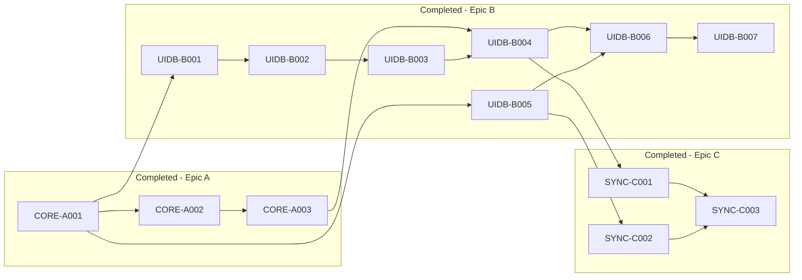

# Active Backlog Summary

**Total Active Story Points:** 0

## Critical Path
None — backlog empty pending next planning stage. Epics A, B, and C (all 52 originally-scoped story points) are complete; no active tickets remain. Run a `/planning-engineering-execution` pass against the deferred follow-ups recorded in `tasks/completed/EPIC-C-security-sync.md` before resuming work.

## Build Order Diagram

## Phasing Strategy
- **In-Scope (Current Phase):** Desktop target exclusively (macOS/Linux). Core FFI parsing, encrypted SQLite storage, and background GitHub sync using OAuth — all now complete. Awaiting the next planning pass to scope further work (deferred integration follow-ups from Epic C, or a new phase of capability work).
- **Deferred (Future Scope):** Mobile targets (iOS/Android) cross-compilation, graph visualization UI, and GitLab support.
