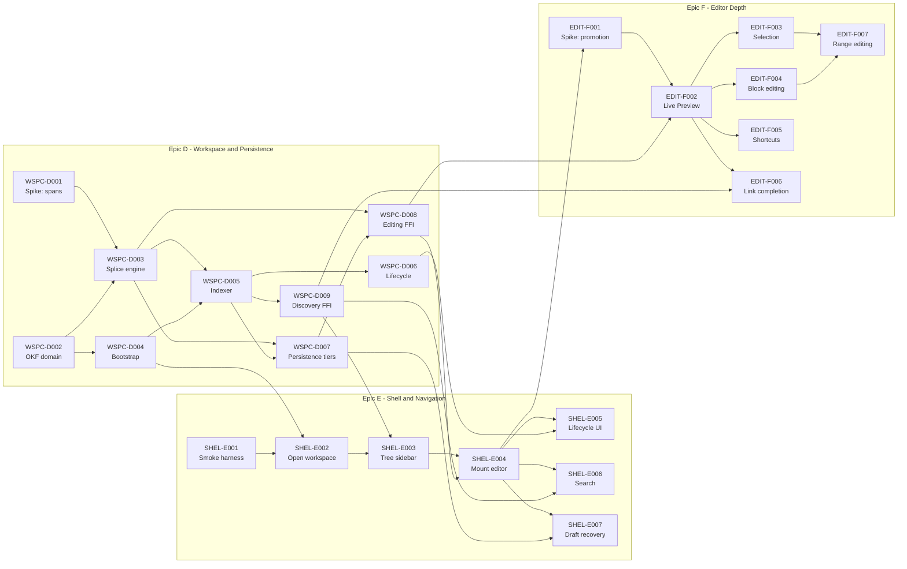

# Active Backlog Summary

**Total Active Story Points:** 105

- Epic D — Workspace & Persistence: 50
- Epic E — Shell & Navigation: 25
- Epic F — Editor Depth: 30

Epics A, B and C (49 points — 10, 23 and 16, summed from the ticket efforts in `completed/`, correcting a 52 carried forward from an earlier revision) are complete and archived under `completed/`; they contribute nothing to the totals or the graph below.

This wave is more than twice the size of everything built so far, which is proportionate to what it does. Epics A–C built four well-tested components — a parser, an encrypted index, Git operations, a sync scheduler — with no wiring between any of them and no reachable path from launching the application to writing a Note. Every production `INSERT` in the repository is still inside a test module, and the application currently opens to a login screen that cannot be passed. This wave builds the application.

## Critical Path

The longest dependency chain is 54 of the 105 points. Everything else can be scheduled around it.

1. `WSPC-D002` — OKF Bundle Domain Module
2. `WSPC-D003` — Span-Preserving Parse and Splice Engine
3. `WSPC-D005` — Bundle Indexer
4. `WSPC-D007` — Persistence Tiers
5. `WSPC-D008` — Editing FFI Surface
6. `SHEL-E004` — Mount the Editor and Navigate
7. `EDIT-F001` — Spike: Rendered-to-Raw Promotion Fidelity
8. `EDIT-F002` — Live Preview Block Promotion
9. `EDIT-F003` — Cross-Block Selection and Copy
10. `EDIT-F007` — Editing Across a Multi-Block Selection

`WSPC-D001` (the splicing Spike) is deliberately *not* on the critical path: it runs in parallel with `WSPC-D002` and completes sooner, so it gates `WSPC-D003` without delaying it. `SHEL-E001` (the smoke harness) is likewise off the path, and should be done early regardless since seven later tickets use it as their gate.

## Build Order Diagram

## Phasing Strategy

### In-Scope (Current Phase)
Desktop only. The outcome is a local-only Workspace the primary actor can use daily: create, rename, move and delete Notes and Directories; write in them with Live Preview across every Block type; select and copy across Blocks; insert Links through completion; search the full text; and have every editing session land in local version history automatically.

The cutover bar is deliberately "genuinely good", not "technically working". Epics D and E alone would produce an application that persists Notes and can open them, but whose editor can only edit plain single-line paragraphs — usable for capture and unpleasant for anything else. Epic F is what makes it worth switching to.

Synchronization is **not** required for that outcome, and this is load-bearing rather than a compromise: in a local-first Workspace every close is a real commit to a real repository, so Notes are version-controlled and recoverable from the first one written. A Remote adds off-machine durability and multi-device access. Neither is a data-safety precondition.

### Deferred (Next Planning Wave)
- **Epic G — Sync Integration.** Connecting a Workspace to a Remote, provisioning or adopting a repository, session restore, credential readback, scheduler lifecycle wiring, the sync status indicator, bounding the scheduler's shutdown wait, and the post-conflict re-push timing question. This absorbs all six of Epic C's deferred follow-ups. The contract surface already exists in `tech-spec/contracts/ffi_api.rs`, so it needs no further Stage 3 work.
- **Epic H — Conflict & Suggestions.** The conflict-marker pre-processor, populating the Suggestion node, and the resolution surface. Note the concrete prerequisite recorded in the contract: `Suggestion.base_content` can only ever be populated if the pull path sets a three-way conflict style, since the default emits no base section — as implemented today that field is structurally dead.
- **Epic I — Quality & Portability.** Continuous integration, images, Export, and the graph visualization. CI was explicitly considered for this wave and deferred by decision; it is recorded as a known risk in `changelog.md` rather than an oversight.

### Built in this wave, surfaced in the next
Three Core capabilities land in Epic D with no consumer in Epic E or F, and are recorded here rather than left to be discovered later — this whole wave exists precisely because Epics A–C shipped Core components nothing called.

- **Backlinks** (`CAP-GRAPH-05`, P1). `WSPC-D009` builds the query and `idx_links_target` backs it, but no ticket surfaces inbound Links in the UI. The index work is not wasted: the same table and index serve the link rewriting that `WSPC-D006` depends on, which is why it is built now rather than deferred wholesale.
- **Title-prefix jump** (`CAP-FIND-02`, P1). `WSPC-D009` builds `find_notes_by_title`, but `SHEL-E006` is full-text search and no ticket surfaces the title jump.
- **Opening a foreign Workspace** (`CAP-WS-05`, P1). `WSPC-D004` exposes it and the indexer tolerates non-conformant files for its sake, but no ticket adds a directory picker.

Separately, three **P0** capability fragments are covered by ticket criteria that never cite them, which is a traceability gap rather than a coverage one — but this section exists precisely so gaps get written down rather than discovered:

- `CAP-EDIT-02`'s Block-type list is covered by `EDIT-F002` for headings, lists, blockquotes and code, but the ticket cites no capability id and **thematic breaks appear in no criterion anywhere**. Added to `EDIT-F002`.
- `CAP-GRAPH-03` (follow a Link to open its target) survives only as an incidental criterion inside `EDIT-F006`, a ticket about *insertion*. Named there explicitly now.
- `CAP-GRAPH-04`'s second half — create the Note by following a ghost Link — had no criterion at all, despite the contract asserting the UI "creates the Note on follow". Added to `EDIT-F006`.

Sweeping every `CAP-*` id against the active tickets and the contract afterwards left four unreferenced, all deferred by design and all already accounted for above: `CAP-EDIT-06` (images) and `CAP-GRAPH-06` (graph visualization) to Epic I, `CAP-SYNC-02` to Epic G, and `CAP-EDIT-07`, a P2 explicitly redundant with the keyboard shortcuts `EDIT-F005` delivers. Two P0s — `CAP-WS-02` and `CAP-WS-04` — were covered by `WSPC-D007` and `WSPC-D004` without being named in either; they are named now.

All three need only UI work to become reachable, and all three belong in the next wave alongside Epic G.

### Deferred (Future Scope)
Mobile targets, multiple simultaneous Workspaces, and adopting a non-empty Remote. Each has a standing entry under `prd/out-of-scope/` explaining the reasoning and the conditions that would reopen it.
