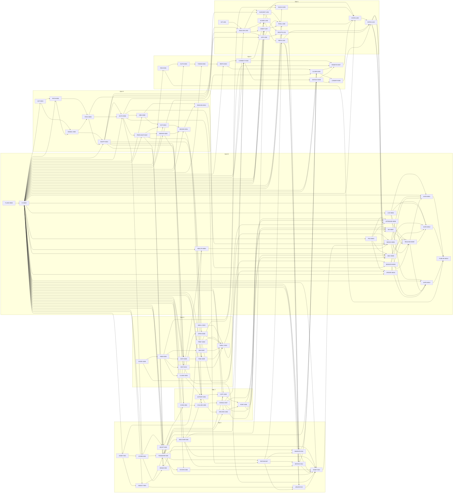

# Active backlog summary

**Total Active Story Points:** 564

The complete forward backlog contains 80 tickets across seven active epics. All specified P0 work is planned. Contract-scoped authorization determines which tickets can execute before the remaining evidence decisions are final.

## Shared execution and generated-output conventions

- Production authorization is contract-scoped. Epic G M0 keeps `SHELL-G001`, `PREF-G002`, `STATE-G003`, `TABS-G004`, `CLOSE-G005`, and `NAV-G007` executable. The bootstrap additionally makes `FLAKE-M002` and `CI-M003` executable. Every other production ticket has an implicit STOP until its own decision evidence, any required Product Requirements or Architecture evolution, final Stage 3 contract, and Stage 4 adaptation are merged. An unrelated unresolved Spike doesn't block an otherwise authorized ticket.
- The five `Spike` tickets remain research-only and executable within their exhaustive allowlists after their declared dependencies are satisfied. `AST-H001`, `PATH-H002`, `ASSET-I001`, and `PKG-M001` require `CI-M003` to be merged into their base because their evidence uses the managed role workflows. Within the declared H Spike tranche, the committed, validated, and independently reviewed `AST-H001` milestone satisfies `PATH-H002`; a draft or unmerged branch never satisfies a cross-tranche or cross-branch dependency.
- A ticket that scopes `rust/src/api/ffi_api.rs` also scopes both generated outputs: `lib/src/rust/**` and `rust/src/frb_generated.rs`. Its verification must regenerate and compare both byte for byte, fail on stale output, and leave the pre-check working tree unchanged. This convention avoids repeating generated files in every FFI ticket without transferring ownership away from the ticket.
- `CI-M003` is authorized to bootstrap with the provisionally aligned Flutter Rust Bridge generator, Rust crate, and Dart package at `2.12.0`. Run the existing generated-binding checker in a disposable checkout. Final Stage 3 must revalidate the triple and generated bytes before a downstream production ticket relies on it.

PR #11 remains the delivered redesign foundation and isn’t retroactively assigned to an epic. `SHELL-G001` removes the presentation-only Platform chrome that leaked from its prototype.

## Authorized tranche sequence

Each tranche uses its own isolated worktree, branch, and pull request created from the then-current merged `master`. Each ticket is one milestone and receives one full milestone review before the next ticket starts. Cross-tranche and cross-branch prerequisites must be merged into the base before the dependent tranche starts. Within one declared tranche, an earlier committed, validated, and independently reviewed milestone satisfies the next ticket; working-tree changes or an unreviewed commit don't.

1. `chore/epic-m-ci-foundation`: `FLAKE-M002`, then `CI-M003`.
2. `spike/epic-h-canonical-foundations`: `AST-H001`, then `PATH-H002`.
3. Constitution evidence-finalization pull request: reconcile the accepted Spike evidence across Stages 1 through 4.
4. `feat/epic-h-authority-foundation`: `MODEL-H003`, `PATH-H005`, `ADAPT-H004`, `AUTH-H006`, then `PREFLIGHT-H007`.
5. Recreate `feat/epic-g-desktop-session` from merged `master`, surgically replay the reviewed Epic G M0 changes without overwriting the merged CI and headless-capture foundation, then execute the remaining Epic G dependency sequence.

The M bootstrap and both H tranches are partial delivery. They don't archive Epic M or Epic H, and the Epic G replay doesn't archive Epic G until every ticket in that epic is complete.

## Critical path

The longest dependency path is **180 story points**:

1. `FLAKE-M002`
2. `CI-M003`
3. `AST-H001`
4. `PATH-H002`
5. `MODEL-H003`
6. `PATH-H005`
7. `ADAPT-H004`
8. `AUTH-H006`
9. `PREFLIGHT-H007`
10. `REPAIR-H008`
11. `CONS-J004`
12. `COLLIDE-J005`
13. `CONSUI-J007`
14. `CONNECT-K004`
15. `SCHED-L003`
16. `REFS-L010`
17. `MIGRATE-I011`
18. `CLONE-K005`
19. `REMOTE-K007`
20. `STATE-L009`
21. `INTEG-L012`
22. `APPIMAGE-M006`
23. `RELEASE-M009`
24. `GATE-M011`
25. `PUBLISH-M014`

The path establishes deterministic CI, managed evidence, both H Spike decisions, and the ordered H authority foundation before canonical Workspace repair and connection-time Consolidation. It then establishes scheduling and complete published-Remote ref enumeration before replacement-store migration, a fresh-device join that can consume the retained fallback, and the Writer-facing Remote workflow. It terminates in publication only after synchronization integration, immutable candidate construction, and the installed AppImage gate. The Nix and macOS gates run in parallel and also block publication.

## Build order diagram

## Phasing strategy

### Phase 1: bootstrap, managed evidence, and authorized tranches

Execute the M bootstrap and H Spike tranches in the recorded merge order. Finalize the constitution from their accepted evidence, merge the ordered H foundation tranche, then replay the six reviewed Epic G M0 milestones onto merged `master` and continue Epic G. The remaining Spikes stay research-only within their allowlists. Every other production ticket waits for its own evidence and required Stages 1 through 4 finalization; there is no global all-Spike stop.

### Phase 2: canonical local application

Build the canonical Note/Workspace/path model, authoritative sessions, conformance adoption/repair, observer, local editing/history/navigation, history-health warning, and the fully integrated local shell. PR #11’s design system is consumed rather than replanned.

### Phase 3: Assets, portability, and private Remote

Implement the Local Asset Store and S3-compatible Object Store, then complete Export, Consolidation, GitHub App authorization, repository lifecycle, second-device join, detach, and reconnect. Credential rotation, replacement-store migration, and full-local preparation remain separate delivery units. These tracks run in parallel wherever the graph permits.

### Phase 4: synchronization and reconciliation

Implement typed Git analysis, the scheduler, content Suggestions, Lifecycle Decisions, Asset Decisions, compare-and-swap finalization, protected Remote refs, and end-to-end private GitHub synchronization.

### Phase 5: quality, candidates, gates, and publication

Complete diagnostics, migration, nightly meters, production AppImage/Flake/macOS packaging, and update notification. Construct immutable unpublished candidates, run separate installed AppImage, Nix, and Apple Silicon macOS gates, and publish the GitHub `0.x` prerelease only after all three pass.

### Explicitly deferred

Only the decisions already under `.constitution/prd/out-of-scope/` remain unplanned: GitLab/second Provider, S3-only Workspaces, authoritative Object Store deletion during `0.x`, HTML export and Publishing, graph visualization, floating formatting toolbar, full history diff viewer, Intel macOS, Linux ARM64, self-updating binaries, signing/notarization during `0.x`, mobile apps, simultaneous Workspaces, and independent-history merging.
