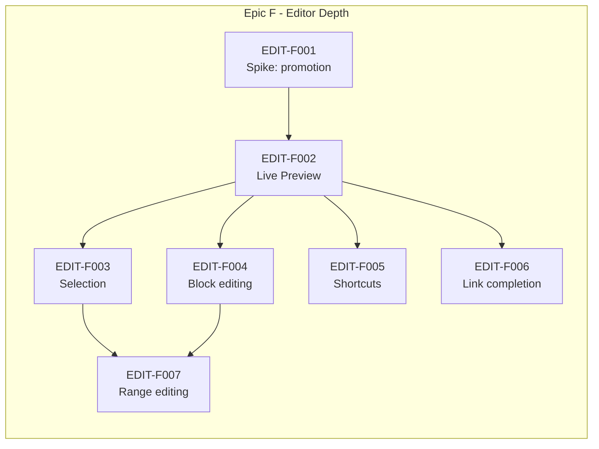

# Active Backlog Summary

**Total Active Story Points:** 30

- Epic F — Editor Depth: 30

Epics A through E (126 points — 10, 23, 16, 50 and 27, summed from the ticket efforts in `completed/`) are complete and archived under `completed/`; they contribute nothing to the totals or the graph below.

Epic E is what changed between v1.6.0 and this revision, and it changed the kind of work this document schedules. The application is usable: it opens straight into the Workspace with no login gate, the Directory tree navigates, the editor mounts and closes every outgoing Note through the commit tier before another opens, Note and Directory lifecycle actions re-anchor identity changes through the Core's id remapping, search and crash recovery are visible surfaces rather than unreachable code, and CAP-WS-06's rescan ships behind a guard that refuses to run under open unflushed sessions. None of that was asserted from widget tests alone — thirteen smoke screenshots were captured by `scripts/smoke-shot.sh` as ticket gates, which is what building the harness first was for. What remains is one epic about writing quality: Live Preview, cross-Block selection, Block manipulation through ordinary typing, Link insertion through completion, and range editing across a multi-Block selection. It is the last thing standing between the current application and the cutover bar described below.

## Critical Path

The longest dependency chain is **18 of the 30 points**. Everything else can be scheduled around it.

1. `EDIT-F001` — Spike: Rendered-to-Raw Promotion Fidelity
2. `EDIT-F002` — Live Preview Block Promotion
3. `EDIT-F003` — Cross-Block Selection and Copy
4. `EDIT-F007` — Editing Across a Multi-Block Selection

With Epic E archived, the chain into `EDIT-F001` is no longer a story worth telling: its remaining dependency, `SHEL-E004`, is done, so the Spike is simply the root of the path, which is now entirely intra-epic. `EDIT-F003` and `EDIT-F004` remain interchangeable at step 3 — both are 5 points, both depend only on `EDIT-F002`, and both feed `EDIT-F007`, so the chain measures 18 either way. `EDIT-F003` stays listed because cross-Block selection is the harder of the two to retrofit.

The scheduling advice carried from the last revision survives as precedent rather than instruction: build the cheapest thing that unblocks the most work first. Here that is still the Spike — five tickets hang off `EDIT-F002`.

**One dependency-modeling lesson stands from Epic D's execution, kept here because future DAGs are still drawn against it.** The published v1.4.0 graph had `WSPC-D006` (Lifecycle) depending only on `WSPC-D005`. In practice it also needed `WSPC-D007` (Persistence Tiers): `D006`'s acceptance criteria require a pathspec-scoped commit covering exactly the paths a lifecycle operation touched, and require carrying every affected Note's buffer, span map, recorded revision and draft row forward through a rename — both of which are `D007`'s to provide. The edge was discovered mid-execution rather than at planning time. The lesson generalizes: a ticket that mutates files *and* must leave open editing sessions coherent depends on whatever owns those sessions, even when the two tickets look independent from their file scopes. No such undeclared edge surfaced during Epic E; its published dependencies held throughout.

## Build Order Diagram

Every Epic E node and every edge out of one is gone from the graph above, Epic E being archived. One of those edges crossed into the remaining work — `SHEL-E004 → EDIT-F001` — and it is **satisfied**, not dropped: the mounted, navigating editor it named now exists in `lib/src/`. The seven intra-epic edges were removed because their source nodes were, not because the dependencies stopped mattering; each delivered the capability its target consumes, and a ticket in this wave that cannot find what it needs should treat that as a defect to report rather than as scope to invent.

## Phasing Strategy

### In-Scope (Current Phase)
Desktop only. The outcome is a local-only Workspace the primary actor can use daily: create, rename, move and delete Notes and Directories; write in them with Live Preview across every Block type; select and copy across Blocks; insert Links through completion; search the full text; and have every editing session land in local version history automatically.

The cutover bar is deliberately "genuinely good", not "technically working". Epics D and E together produce an application that persists Notes, opens them, navigates them, searches them and recovers them — but whose editor can only edit plain single-line paragraphs: usable for capture and unpleasant for anything else. Epic F is what makes it worth switching to.

Synchronization is **not** required for that outcome, and this is load-bearing rather than a compromise: in a local-first Workspace every close is a real commit to a real repository, so Notes are version-controlled and recoverable from the first one written. A Remote adds off-machine durability and multi-device access. Neither is a data-safety precondition.

### Deferred (Next Planning Wave)
Wave 3 was shaped by the realignment interview (2026-08-21) rather than inherited: it runs **two genuinely parallel tracks** — the sync/conflict backbone and the interactive design epic — with the handoff points drawn below per open decision OD-03. Every capability the realignment added has a home here, and the three built-but-unsurfaced capabilities from earlier waves are placed below as well; nothing in the active capability list is without a home or a named deferral.

**Track 1 — sync backbone:**
- **Epic G — Sync Integration**, carrying: connect and detach (`CAP-SYNC-01/06`), second-device join via `clone_workspace` (`CAP-SYNC-07`) with guided consolidation (`CAP-SYNC-08`, `plan_consolidation`/`apply_consolidation`), session restore, credential readback, scheduler lifecycle wiring, the sync status indicator, bounding the scheduler's shutdown wait, and the post-conflict re-push timing question. Absorbs all six of Epic C's deferred follow-ups plus the `rust/src/api/auth.rs` rework, which is not a wiring item: `OAuthFlowStart` currently returns `code_verifier` and `state`; the contract returns a single-use `flow_id` and neither secret, and `authenticate_workspace(flow_id, auth_code, returned_state) -> SessionState` must raise `OAuthStateMismatch` before any token request. Until Epic G lands, the shipped code still mints a `state` nothing compares — the original CSRF defect, unchanged — and this supersedes Epic C's recorded position that the verifier transiting Dart was an accepted decision: under the current contract it does not transit Dart at all.
- **Epic H — Conflict & Suggestions**: conflict-marker pre-processing, populating the Suggestion node, block-level accept/reject (`CAP-SYNC-04` as ruled at Q4), markers flowing freely through commits per B3, and the delete-vs-edit restore-and-suggest path from Q6. Prerequisite recorded in the contract: `Suggestion.base_content` requires the pull path to set a three-way conflict style.
- **GitLab provider** (`CAP-SYNC-09`, P1) lands behind GitHub inside this track once the seam has one proven consumer (ADR-009, B5).

**Track 2 — design system and surfaces:**
- **Design & Preferences epic** (`CAP-PREF-01`): interactive by decision — human-driven design work expressed through `hitl_sil` and `visual_regression` acceptance modes, not Gherkin-by-default. Produces burlmd's design tokens. Owes the string externalization and `Semantics` pass recorded at `tech-spec/changelog.md` v1.4.0 — Epic E's widgets ship hardcoded literals with no accessibility labels, and retrofitting extraction across more surfaces only gets more expensive.

**Handoff points between tracks (OD-03):** the design epic delivers tokens before three consuming surfaces build final UI: the sync status indicator (Epic G renders it, but its visual form waits for tokens), the editor chrome Epic F's wave-3 follow-ups touch, and CAP-PORT-04's rendition, which is explicitly sequenced behind this epic. When both tracks want the same hands on the same day, Track 1's correctness work wins and design slips — solo-dev reality, stated here so the slip is planned rather than felt as failure.

**Riding either track, placed by dependency rather than by theme:**
- Undo (`CAP-EDIT-08`), version restore (`CAP-HIST-01`), in-Note find & replace (`CAP-FIND-03`) — a Wave-3 editor-depth cluster after Epic F proves the promotion model; each consumes its declared contract surface (`undo_note`/`redo_note`, `list_note_versions`/`restore_note_version`, `find_in_note`/`replace_all_in_note`).
- Diagnostics export (`CAP-SUP-01`) — rides Epic I alongside CI, since ADR-011's log channel and the nightly benchmark share the observability work.
- The three built-but-unsurfaced capabilities — backlinks (`CAP-GRAPH-05`), the title-prefix jump (`CAP-FIND-02`), and opening a foreign Workspace (`CAP-WS-05`) — surface as small UI tickets inside Track 1: they need only shell work over shipped Core, and the foreign-Workspace picker is a natural neighbor of `clone_workspace`'s destination selection.
- **Epic I — Quality & Portability** (revised): continuous integration as the Linux+macOS matrix chosen at Q9, the nightly non-blocking benchmark job verifying every meter in `prd/constraints.md`, images (`CAP-EDIT-06`, `assets/` per Q7), Export surfacing (`CAP-PORT-02`, `export_workspace` + `.okf` archive), and the graph visualization (`CAP-GRAPH-06`).

### Built, and still unsurfaced
Three Core capabilities were built in Epic D with no consumer in Epic E or F. They remain unreachable from the running application after Epic E — which is exactly the state this section exists to keep visible, since the whole point of this wave structure was that Epics A–C shipped Core components nothing called, and calling nothing twice would repeat the failure.

- **Backlinks** (`CAP-GRAPH-05`, P1). `WSPC-D009` built the query and `idx_links_target` backs it, but no ticket surfaces inbound Links in the UI. The index work was not wasted: the same table and index serve the link rewriting `WSPC-D006` depends on, which is why it was built then rather than deferred wholesale.
- **Title-prefix jump** (`CAP-FIND-02`, P1). `WSPC-D009` built `find_notes_by_title`, but `SHEL-E006` is full-text search and no ticket surfaces the title jump. Two notes for whoever picks it up: it matches a **leading prefix only**, which is a deliberate Stage 3 narrowing of CAP-FIND-02's "part of its title" recorded in `tech-spec/contracts/ffi_api.rs`; and its per-keystroke cost is unmeasured, since `schema.sql` declares no index on `notes(title)` and the query scans the Workspace's rows. Measure it before putting it behind a palette.
- **Opening a foreign Workspace** (`CAP-WS-05`, P1). `WSPC-D004` exposed it and the indexer tolerates non-conformant files for its sake, but no ticket adds a directory picker.

Separately, three capability fragments — two P0, one P1 — are covered by ticket criteria that never cite them, which is a traceability gap rather than a coverage one — but this section exists precisely so gaps get written down rather than discovered:

- `CAP-EDIT-02`'s Block-type list is covered by `EDIT-F002` for headings, lists, blockquotes and code, but the ticket cites no capability id and **thematic breaks appear in no criterion anywhere**. Added to `EDIT-F002`.
- `CAP-GRAPH-03` (follow a Link to open its target) survives only as an incidental criterion inside `EDIT-F006`, a ticket about *insertion*. Named there explicitly now.
- `CAP-GRAPH-04`'s second half — create the Note by following a ghost Link — had no criterion at all, despite the contract asserting the UI "creates the Note on follow". Added to `EDIT-F006`.

Sweeping every `CAP-*` id against the active tickets and the contract afterwards left four unreferenced, all deferred by design and all already accounted for above: `CAP-EDIT-06` (images) and `CAP-GRAPH-06` (graph visualization) to Epic I, `CAP-SYNC-02` to Epic G, and `CAP-EDIT-07`, a P2 explicitly redundant with the keyboard shortcuts `EDIT-F005` delivers. Two P0s — `CAP-WS-02` and `CAP-WS-04` — were covered by `WSPC-D007` and `WSPC-D004` without being named in either; they are named now.

The three built-but-unsurfaced capabilities above need only shell work over shipped Core to become reachable — Epic E proved that shape twice over, turning `search_notes` and the recovery/write-status queries into user-facing surfaces (`SHEL-E006`, `SHEL-E007`) without touching Rust. All three are placed in Wave 3's Track 1 above. The traceability fragments listed after them are a separate matter, and are closed in this wave.

### Deferred (Future Scope)
Mobile targets, multiple simultaneous Workspaces, and adopting a non-empty Remote. Each has a standing entry under `prd/out-of-scope/` explaining the reasoning and the conditions that would reopen it.
