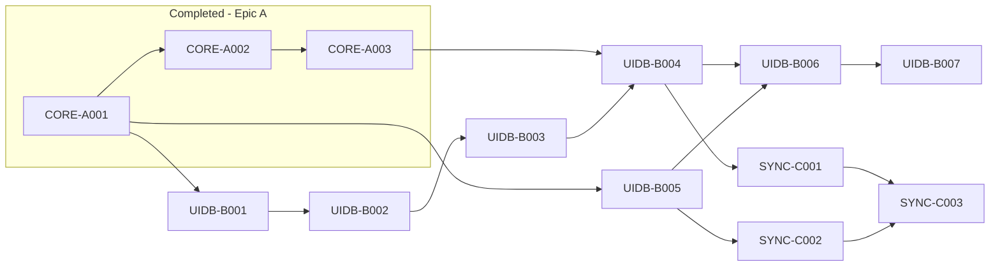

# Active Backlog Summary

**Total Active Story Points:** 39

## Critical Path
1. UIDB-B001
2. UIDB-B002
3. UIDB-B003
4. UIDB-B004
5. UIDB-B005
6. UIDB-B006
7. UIDB-B007
8. SYNC-C001
9. SYNC-C002
10. SYNC-C003

## Build Order Diagram

## Phasing Strategy
- **In-Scope (Current Phase):** Desktop target exclusively (macOS/Linux). Core FFI parsing, encrypted SQLite storage, and background GitHub sync using OAuth.
- **Deferred (Future Scope):** Mobile targets (iOS/Android) cross-compilation, graph visualization UI, and GitLab support.
