# Active backlog summary

**Total Active Story Points:** 564

The complete forward backlog contains 80 tickets across seven active epics. All specified P0 work is planned. The five decision-producing Spikes are the first tickets in the epics they govern.

## Shared execution and generated-output conventions

- While Stage 3 remains provisional, only the five `Spike` tickets are executable. Every production ticket has an implicit STOP before implementation until measured Product Requirements and Architecture evolution is accepted, Stage 3 is final, and Stage 4 has adapted that ticket’s scope, estimate, dependencies, and exact verification command. This shared STOP applies even when a production ticket has no Spike dependency.
- A ticket that scopes `rust/src/api/ffi_api.rs` also scopes both generated outputs: `lib/src/rust/**` and `rust/src/frb_generated.rs`. Its verification must regenerate and compare both byte for byte, fail on stale output, and leave the pre-check working tree unchanged. This convention avoids repeating generated files in every FFI ticket without transferring ownership away from the ticket.

PR #11 remains the delivered redesign foundation and isn’t retroactively assigned to an epic. `SHELL-G001` removes the presentation-only Platform chrome that leaked from its prototype.

## Critical path

The longest dependency path is **153 story points**:

1. `AST-H001`
2. `MODEL-H003`
3. `ADAPT-H004`
4. `AUTH-H006`
5. `PREFLIGHT-H007`
6. `REPAIR-H008`
7. `CONS-J004`
8. `COLLIDE-J005`
9. `CONSUI-J007`
10. `CONNECT-K004`
11. `SCHED-L003`
12. `REFS-L010`
13. `MIGRATE-I011`
14. `CLONE-K005`
15. `REMOTE-K007`
16. `STATE-L009`
17. `INTEG-L012`
18. `APPIMAGE-M006`
19. `RELEASE-M009`
20. `GATE-M011`
21. `PUBLISH-M014`

The path establishes canonical Workspace repair and connection-time Consolidation before initial Remote publication. It then establishes scheduling and complete published-Remote ref enumeration before replacement-store migration, a fresh-device join that can consume the retained fallback, and the Writer-facing Remote workflow. It terminates in publication only after synchronization integration, immutable candidate construction, and the installed AppImage gate. The Nix and macOS gates run in parallel and also block publication.

## Build order diagram

```mermaid
flowchart LR
    subgraph EpicG["Epic G"]
        SHELLG001[SHELL-G001]
        PREFG002[PREF-G002]
        STATEG003[STATE-G003]
        TABSG004[TABS-G004]
        CLOSEG005[CLOSE-G005]
        OPENG006[OPEN-G006]
        NAVG007[NAV-G007]
        EDITG008[EDIT-G008]
        FINDG009[FIND-G009]
        HISTG010[HIST-G010]
        SHELLG011[SHELL-G011]
    end
    subgraph EpicH["Epic H"]
        ASTH001[AST-H001]
        PATHH002[PATH-H002]
        MODELH003[MODEL-H003]
        ADAPTH004[ADAPT-H004]
        PATHH005[PATH-H005]
        AUTHH006[AUTH-H006]
        PREFLIGHTH007[PREFLIGHT-H007]
        REPAIRH008[REPAIR-H008]
        OBSH009[OBS-H009]
        EXTH010[EXT-H010]
        DECIDEH011[DECIDE-H011]
        RESCANH012[RESCAN-H012]
    end
    subgraph EpicI["Epic I"]
        ASSETI001[ASSET-I001]
        STOREI002[STORE-I002]
        IMAGEI003[IMAGE-I003]
        OBJECTI004[OBJECT-I004]
        TRANSFERI005[TRANSFER-I005]
        RECOVERI006[RECOVER-I006]
        RETAINI007[RETAIN-I007]
        ROTATEI008[ROTATE-I008]
        MIGRATEI011[MIGRATE-I011]
        DETACHI012[DETACH-I012]
        UNLINKI013[UNLINK-I013]
        ADOPTI009[ADOPT-I009]
        ASSETI010[ASSET-I010]
    end
    subgraph EpicJ["Epic J"]
        EXPORTJ001[EXPORT-J001]
        COPYJ002[COPY-J002]
        ARCHIVEJ003[ARCHIVE-J003]
        CONSJ004[CONS-J004]
        COLLIDEJ005[COLLIDE-J005]
        PORTJ006[PORT-J006]
        CONSUIJ007[CONSUI-J007]
    end
    subgraph EpicK["Epic K"]
        REGK001[REG-K001]
        AUTHK001[AUTH-K001]
        TOKENK002[TOKEN-K002]
        REPOK003[REPO-K003]
        CONNECTK004[CONNECT-K004]
        CLONEK005[CLONE-K005]
        DETACHK006[DETACH-K006]
        REMOTEK007[REMOTE-K007]
        CANARYK008[CANARY-K008]
    end
    subgraph EpicL["Epic L"]
        GITL001[GIT-L001]
        ANALYZEL002[ANALYZE-L002]
        SCHEDL003[SCHED-L003]
        SUGGESTL004[SUGGEST-L004]
        SUGUIL005[SUGUI-L005]
        LIFEL006[LIFE-L006]
        ASSETL007[ASSET-L007]
        FINALL008[FINAL-L008]
        STATEL009[STATE-L009]
        REFSL010[REFS-L010]
        DELETEL011[DELETE-L011]
        INTEGL012[INTEG-L012]
    end
    subgraph EpicM["Epic M"]
        PKGM001[PKG-M001]
        LOGM002[LOG-M002]
        FLAKEM002[FLAKE-M002]
        CIM003[CI-M003]
        BENCHM004[BENCH-M004]
        HEALTHM004[HEALTH-M004]
        MIGRATEM005[MIGRATE-M005]
        APPIMAGEM006[APPIMAGE-M006]
        NIXM007[NIX-M007]
        MACM008[MAC-M008]
        RELEASEM009[RELEASE-M009]
        UPDATEM010[UPDATE-M010]
        GATEM011[GATE-M011]
        GATEM012[GATE-M012]
        GATEM013[GATE-M013]
        PUBLISHM014[PUBLISH-M014]
    end
    STATEG003 --> TABSG004
    TABSG004 --> CLOSEG005
    CLOSEG005 --> OPENG006
    PREFLIGHTH007 --> OPENG006
    TABSG004 --> NAVG007
    TABSG004 --> EDITG008
    ADAPTH004 --> EDITG008
    EDITG008 --> FINDG009
    ADAPTH004 --> FINDG009
    TABSG004 --> HISTG010
    ADAPTH004 --> HISTG010
    SHELLG001 --> SHELLG011
    PREFG002 --> SHELLG011
    OPENG006 --> SHELLG011
    NAVG007 --> SHELLG011
    FINDG009 --> SHELLG011
    HISTG010 --> SHELLG011
    ASTH001 --> MODELH003
    MODELH003 --> ADAPTH004
    PATHH002 --> PATHH005
    ADAPTH004 --> AUTHH006
    PATHH005 --> AUTHH006
    AUTHH006 --> PREFLIGHTH007
    PREFLIGHTH007 --> REPAIRH008
    AUTHH006 --> OBSH009
    OBSH009 --> EXTH010
    PREFLIGHTH007 --> EXTH010
    EXTH010 --> DECIDEH011
    REPAIRH008 --> DECIDEH011
    OBSH009 --> RESCANH012
    ASSETI001 --> STOREI002
    AUTHH006 --> STOREI002
    STOREI002 --> IMAGEI003
    ADAPTH004 --> IMAGEI003
    ASSETI001 --> OBJECTI004
    STOREI002 --> TRANSFERI005
    OBJECTI004 --> TRANSFERI005
    TRANSFERI005 --> RECOVERI006
    TRANSFERI005 --> RETAINI007
    AUTHH006 --> RETAINI007
    TRANSFERI005 --> ROTATEI008
    TRANSFERI005 --> MIGRATEI011
    RETAINI007 --> MIGRATEI011
    RETAINI007 --> DETACHI012
    RECOVERI006 --> DETACHI012
    STOREI002 --> ADOPTI009
    PREFLIGHTH007 --> ADOPTI009
    IMAGEI003 --> ASSETI010
    RECOVERI006 --> ASSETI010
    ROTATEI008 --> ASSETI010
    MIGRATEI011 --> ASSETI010
    DETACHI012 --> ASSETI010
    ADOPTI009 --> ASSETI010
    HISTG010 --> ASSETI010
    CLOSEG005 --> EXPORTJ001
    DECIDEH011 --> EXPORTJ001
    RECOVERI006 --> EXPORTJ001
    EXPORTJ001 --> COPYJ002
    TRANSFERI005 --> COPYJ002
    EXPORTJ001 --> ARCHIVEJ003
    TRANSFERI005 --> ARCHIVEJ003
    REPAIRH008 --> CONSJ004
    ADOPTI009 --> CONSJ004
    CONSJ004 --> COLLIDEJ005
    COPYJ002 --> PORTJ006
    ARCHIVEJ003 --> PORTJ006
    COLLIDEJ005 --> CONSUIJ007
    CONSUIJ007 --> CONNECTK004
    AUTHK001 --> TOKENK002
    TOKENK002 --> REPOK003
    REPOK003 --> CONNECTK004
    TRANSFERI005 --> CONNECTK004
    REPOK003 --> CLONEK005
    REPAIRH008 --> CLONEK005
    TRANSFERI005 --> CLONEK005
    MIGRATEI011 --> CLONEK005
    CONNECTK004 --> DETACHK006
    DETACHI012 --> DETACHK006
    CONNECTK004 --> REMOTEK007
    PREFG002 --> REMOTEK007
    CLONEK005 --> CANARYK008
    DETACHK006 --> CANARYK008
    GITL001 --> ANALYZEL002
    ADAPTH004 --> ANALYZEL002
    PATHH005 --> ANALYZEL002
    ANALYZEL002 --> SCHEDL003
    CONNECTK004 --> SCHEDL003
    ANALYZEL002 --> SUGGESTL004
    ADAPTH004 --> SUGGESTL004
    SUGGESTL004 --> SUGUIL005
    TABSG004 --> SUGUIL005
    ANALYZEL002 --> LIFEL006
    AUTHH006 --> LIFEL006
    ANALYZEL002 --> ASSETL007
    RECOVERI006 --> ASSETL007
    SUGGESTL004 --> FINALL008
    LIFEL006 --> FINALL008
    ASSETL007 --> FINALL008
    SCHEDL003 --> STATEL009
    SUGUIL005 --> STATEL009
    FINALL008 --> STATEL009
    REMOTEK007 --> STATEL009
    SCHEDL003 --> REFSL010
    RETAINI007 --> REFSL010
    SUGGESTL004 --> DELETEL011
    LIFEL006 --> DELETEL011
    STATEL009 --> INTEGL012
    REFSL010 --> INTEGL012
    DELETEL011 --> INTEGL012
    CANARYK008 --> INTEGL012
    SHELLG011 --> BENCHM004
    RESCANH012 --> BENCHM004
    ASSETI010 --> BENCHM004
    INTEGL012 --> BENCHM004
    HEALTHM004 --> BENCHM004
    ASSETI001 --> HEALTHM004
    HISTG010 --> HEALTHM004
    STATEG003 --> MIGRATEM005
    AUTHH006 --> MIGRATEM005
    PKGM001 --> APPIMAGEM006
    PORTJ006 --> APPIMAGEM006
    CONSUIJ007 --> APPIMAGEM006
    INTEGL012 --> APPIMAGEM006
    SHELLG011 --> APPIMAGEM006
    PKGM001 --> NIXM007
    PORTJ006 --> NIXM007
    CONSUIJ007 --> NIXM007
    INTEGL012 --> NIXM007
    PKGM001 --> MACM008
    CIM003 --> MACM008
    PORTJ006 --> MACM008
    CONSUIJ007 --> MACM008
    INTEGL012 --> MACM008
    APPIMAGEM006 --> RELEASEM009
    NIXM007 --> RELEASEM009
    MACM008 --> RELEASEM009
    UPDATEM010 --> RELEASEM009
    PKGM001 --> UPDATEM010
    PREFG002 --> UPDATEM010
    LOGM002 --> GATEM011
    CIM003 --> GATEM011
    BENCHM004 --> GATEM011
    MIGRATEM005 --> GATEM011
    RELEASEM009 --> GATEM011
    LOGM002 --> GATEM012
    CIM003 --> GATEM012
    BENCHM004 --> GATEM012
    MIGRATEM005 --> GATEM012
    RELEASEM009 --> GATEM012
    LOGM002 --> GATEM013
    CIM003 --> GATEM013
    BENCHM004 --> GATEM013
    MIGRATEM005 --> GATEM013
    RELEASEM009 --> GATEM013
    GATEM011 --> PUBLISHM014
    GATEM012 --> PUBLISHM014
    GATEM013 --> PUBLISHM014
    REGK001 --> PUBLISHM014
    CIM003 --> EDITG008
    CIM003 --> FINDG009
    CIM003 --> HISTG010
    CIM003 --> ANALYZEL002
    CIM003 --> SCHEDL003
    CIM003 --> SUGGESTL004
    CIM003 --> SUGUIL005
    CIM003 --> LIFEL006
    CIM003 --> ASSETL007
    CIM003 --> FINALL008
    CIM003 --> STATEL009
    CIM003 --> DELETEL011
    CIM003 --> LOGM002
    CIM003 --> HEALTHM004
    LOGM002 --> RELEASEM009
    BENCHM004 --> RELEASEM009
    MIGRATEM005 --> RELEASEM009
    CIM003 --> UPDATEM010
    CIM003 --> STOREI002
    CIM003 --> IMAGEI003
    CIM003 --> OBJECTI004
    CIM003 --> TRANSFERI005
    CIM003 --> RECOVERI006
    CIM003 --> ROTATEI008
    CIM003 --> MIGRATEI011
    CIM003 --> DETACHI012
    CIM003 --> ADOPTI009
    CIM003 --> ASSETI010
    CIM003 --> AUTHK001
    CIM003 --> TOKENK002
    CIM003 --> REPOK003
    CIM003 --> CONNECTK004
    CIM003 --> CLONEK005
    CIM003 --> DETACHK006
    CIM003 --> ADAPTH004
    CIM003 --> AUTHH006
    CIM003 --> PREFLIGHTH007
    CIM003 --> REPAIRH008
    CIM003 --> OBSH009
    CIM003 --> EXTH010
    CIM003 --> DECIDEH011
    CIM003 --> EXPORTJ001
    CIM003 --> COPYJ002
    CIM003 --> ARCHIVEJ003
    CIM003 --> CONSJ004
    CIM003 --> COLLIDEJ005
    CLONEK005 --> REMOTEK007
    DETACHK006 --> REMOTEK007
    REFSL010 --> MIGRATEI011
    REFSL010 --> DETACHI012
    DECIDEH011 --> RESCANH012
    CIM003 --> REGK001
    REGK001 --> AUTHK001
    OBJECTI004 --> UNLINKI013
    RETAINI007 --> UNLINKI013
    REFSL010 --> UNLINKI013
    CIM003 --> UNLINKI013
    UNLINKI013 --> ASSETI010
    FLAKEM002 --> CIM003
```

## Phasing strategy

### Phase 1: decision evidence

Execute only the five Spikes. They produce reports, not production changes. When their evidence lands, run the required measured Product Requirements and Architecture evolution and final Stage 3 pass, then adapt every production ticket before implementation.

### Phase 2: canonical local application

Build the canonical Note/Workspace/path model, authoritative sessions, conformance adoption/repair, observer, local editing/history/navigation, history-health warning, and the fully integrated local shell. PR #11’s design system is consumed rather than replanned.

### Phase 3: Assets, portability, and private Remote

Implement the Local Asset Store and S3-compatible Object Store, then complete Export, Consolidation, GitHub App authorization, repository lifecycle, second-device join, detach, and reconnect. Credential rotation, replacement-store migration, and full-local preparation remain separate delivery units. These tracks run in parallel wherever the graph permits.

### Phase 4: synchronization and reconciliation

Implement typed Git analysis, the scheduler, content Suggestions, Lifecycle Decisions, Asset Decisions, compare-and-swap finalization, protected Remote refs, and end-to-end private GitHub synchronization.

### Phase 5: quality, candidates, gates, and publication

Complete diagnostics, migration, nightly meters, production AppImage/Flake/macOS packaging, and update notification. Construct immutable unpublished candidates, run separate installed AppImage, Nix, and Apple Silicon macOS gates, and publish the GitHub `0.x` prerelease only after all three pass.

### Explicitly deferred

Only the decisions already under `.constitution/prd/out-of-scope/` remain unplanned: GitLab/second Provider, S3-only Workspaces, authoritative Object Store deletion during `0.x`, HTML export and Publishing, graph visualization, floating formatting toolbar, full history diff viewer, Intel macOS, Linux ARM64, self-updating binaries, signing/notarization during `0.x`, mobile apps, simultaneous Workspaces, and independent-history merging.
