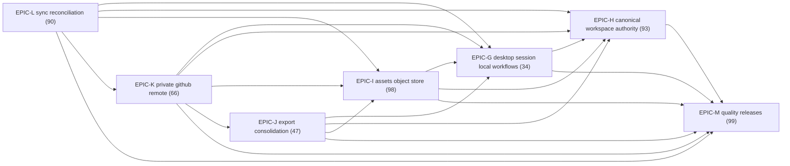

# Critical path

Generated by `constitution-tooling render` from `tasks/epics/`. Do not edit by hand; change the epic files and render again.

## Totals

| Active epics | Open points | Out-of-band epics | Out-of-band points | Waves | Widest wave | Longest chain (points) |
| :--- | :--- | :--- | :--- | :--- | :--- | :--- |
| 7 | 527 | 0 | 0 | 7 | 1 | 527 |

## Longest chain

EPIC-M → EPIC-H → EPIC-G → EPIC-I → EPIC-J → EPIC-K → EPIC-L (527 points). This bounds wall-clock time however many lanes run.

## Waves

An epic joins a wave when every dependency sits in an earlier wave and it is scope-disjoint from every other epic in the wave. A wave of one is a serial segment.

| Wave | Epic | Kind | Open points | Owns | May patch | Depends on |
| :--- | :--- | :--- | :--- | :--- | :--- | :--- |
| 1 | EPIC-M quality releases | tooling | 99 | `.constitution/prototypes/packaging/**`, `.constitution/spikes/SPK-BURL-M001.md`, `rust/src/diagnostics/**`, `rust/src/api/ffi_api.rs`, `rust/Cargo.toml`, `rust/Cargo.lock`, `lib/src/components/**`, `test/**`, `rust/src/workspace/persist.rs`, `scripts/repeat-test.sh`, `.github/workflows/ci.yml`, `.github/workflows/ci-role-linux-x86-64.yml`, `.github/workflows/ci-role-macos-26-arm64.yml`, `.github/workflows/ci-role-macos-15-arm64.yml`, `devenv.nix`, `devenv.lock`, `scripts/**`, `lib/visual_capture_main.dart`, `test_driver/visual_capture_driver.dart`, `test/visual_capture_driver_protocol_test.dart`, `test/goldens/**`, `integration_test/**`, `.constitution/reports/**`, `rust/benches/**`, `.github/workflows/**`, `rust/src/git/**`, `lib/src/providers/**`, `rust/src/db/**`, `rust/src/workspace/**`, `linux/**`, `pubspec.yaml`, `pubspec.lock`, `flake.nix`, `flake.lock`, `nix/**`, `macos/**`, `rust/src/update/**`, `lib/src/providers/burl_preferences_provider.dart`, `config/github-app.release.toml` | — | — |
| 2 | EPIC-H canonical workspace authority | product | 93 | `.constitution/prototypes/ast/**`, `.constitution/spikes/SPK-BURL-H001.md`, `.constitution/prototypes/path/**`, `.constitution/spikes/SPK-BURL-H002.md`, `rust/src/markdown/**`, `rust/src/draft.rs`, `rust/Cargo.toml`, `rust/Cargo.lock`, `rust/src/api/**`, `rust/src/index/**`, `rust/src/workspace/**`, `lib/src/rust/**`, `lib/src/components/block_view.dart`, `lib/src/components/editor.dart`, `lib/src/providers/rust_api_provider.dart`, `test/**`, `rust/src/okf/concept_id.rs`, `rust/src/db/**`, `rust/src/api/ffi_api.rs`, `rust/src/workspace/bootstrap.rs`, `rust/src/index/scan.rs`, `rust/src/okf/**`, `lib/src/components/**`, `rust/src/git/operations.rs`, `lib/src/providers/workspace_provider.dart`, `lib/src/providers/note_providers.dart`, `lib/src/screens/workspace.dart`, `test/screens/workspace_rescan_test.dart` | — | EPIC-M |
| 3 | EPIC-G desktop session local workflows | product | 34 | `lib/src/design/workspace_shell.dart`, `lib/src/design/burl_theme.dart`, `lib/src/providers/burl_preferences_provider.dart`, `lib/src/components/visual_parity_fixture.dart`, `test/goldens/**`, `lib/l10n/**`, `test/**`, `integration_test/**`, `scripts/visual-regression.sh`, `lib/src/design/**`, `lib/src/screens/workspace.dart`, `test/providers/**`, `test/screens/**`, `lib/src/providers/workspace_provider.dart`, `lib/src/providers/search_provider.dart`, `rust/src/db/**`, `rust/src/workspace/**`, `rust/src/api/ffi_api.rs`, `rust/src/frb_generated.rs`, `lib/src/rust/**`, `lib/src/providers/note_providers.dart`, `scripts/smoke-shot.sh`, `rust/src/workspace/persist.rs`, `rust/src/workspace/bootstrap.rs`, `lib/src/components/**`, `test/components/**`, `rust/src/draft.rs`, `rust/src/markdown/**`, `lib/src/components/editor.dart`, `rust/src/git/operations.rs` | — | EPIC-H, EPIC-M |
| 4 | EPIC-I assets object store | product | 98 | `.constitution/prototypes/assets/**`, `.constitution/spikes/SPK-BURL-I001.md`, `rust/src/assets/**`, `rust/src/workspace/**`, `rust/src/git/operations.rs`, `rust/src/api/ffi_api.rs`, `rust/Cargo.toml`, `rust/Cargo.lock`, `test/**`, `rust/src/markdown/**`, `lib/src/components/editor.dart`, `lib/src/components/block_view.dart`, `lib/src/providers/note_providers.dart`, `pubspec.yaml`, `pubspec.lock`, `linux/**`, `macos/**`, `integration_test/**`, `rust/src/object_store/**`, `rust/src/security/**`, `lib/src/components/**`, `rust/src/sync/**`, `lib/src/providers/**`, `rust/src/workspace/bootstrap.rs` | — | EPIC-G, EPIC-H, EPIC-M |
| 5 | EPIC-J export consolidation | product | 47 | `rust/src/workspace/**`, `rust/src/api/ffi_api.rs`, `test/**`, `rust/src/export/**`, `rust/src/assets/**`, `lib/src/components/**`, `lib/src/providers/workspace_provider.dart`, `lib/src/screens/workspace.dart`, `lib/l10n/**`, `integration_test/**` | — | EPIC-G, EPIC-H, EPIC-I, EPIC-M |
| 6 | EPIC-K private github remote | product | 66 | `config/github-app.release.toml`, `docs/github-app-installation.md`, `scripts/attest-github-app-token-expiration.sh`, `scripts/verify-github-app-registration.sh`, `.github/workflows/**`, `.constitution/reports/**`, `rust/src/api/auth.rs`, `rust/src/api/ffi_api.rs`, `lib/src/providers/auth_provider.dart`, `lib/src/screens/login.dart`, `test/providers/auth_provider_test.dart`, `test/screens/login_test.dart`, `rust/src/security/**`, `test/**`, `rust/src/provider/**`, `lib/src/components/**`, `rust/src/git/operations.rs`, `rust/src/sync/**`, `integration_test/connect_consolidation_flow_test.dart`, `rust/src/workspace/bootstrap.rs`, `rust/src/object_store/**`, `scripts/verify-second-device-join.sh`, `lib/src/providers/workspace_provider.dart`, `lib/src/screens/workspace.dart`, `lib/l10n/**`, `integration_test/**`, `scripts/**` | — | EPIC-G, EPIC-H, EPIC-I, EPIC-J, EPIC-M |
| 7 | EPIC-L sync reconciliation | product | 90 | `.constitution/prototypes/git-analysis/**`, `.constitution/spikes/SPK-BURL-L001.md`, `rust/src/git/**`, `rust/src/sync/**`, `rust/src/api/ffi_api.rs`, `rust/Cargo.toml`, `rust/Cargo.lock`, `test/**`, `rust/src/bin/sync_freshness_meter.rs`, `lib/src/providers/workspace_provider.dart`, `rust/src/markdown/**`, `lib/src/components/editor.dart`, `lib/src/components/block_view.dart`, `lib/src/providers/note_providers.dart`, `rust/src/workspace/**`, `lib/src/components/**`, `rust/src/assets/**`, `rust/src/object_store/**`, `rust/src/db/**`, `lib/l10n/**`, `lib/src/providers/**`, `integration_test/**` | — | EPIC-G, EPIC-H, EPIC-I, EPIC-K, EPIC-M |

## Build order

An arrow means depends on.

## Ticket order inside each epic

- **EPIC-G:** BURL-G001 → BURL-G002 → BURL-G003 → BURL-G004 → BURL-G005 → BURL-G006 (deferred) → BURL-G007 → BURL-G008 (deferred) → BURL-G009 (deferred) → BURL-G010 (deferred) → BURL-G011 (deferred)
- **EPIC-H:** BURL-H001 → BURL-H002 → BURL-H003 → BURL-H005 → BURL-H004 → BURL-H006 → BURL-H007 → BURL-H008 → BURL-H009 → BURL-H010 → BURL-H011 → BURL-H012
- **EPIC-I:** BURL-I001 → BURL-I002 → BURL-I003 → BURL-I004 → BURL-I005 → BURL-I006 → BURL-I007 → BURL-I008 → BURL-I011 → BURL-I012 → BURL-I013 → BURL-I009 → BURL-I010
- **EPIC-J:** BURL-J001 → BURL-J002 → BURL-J003 → BURL-J004 → BURL-J005 → BURL-J006 → BURL-J007
- **EPIC-K:** BURL-K009 → BURL-K001 → BURL-K002 → BURL-K003 → BURL-K004 → BURL-K005 → BURL-K006 → BURL-K007 → BURL-K008
- **EPIC-L:** BURL-L001 → BURL-L002 → BURL-L003 → BURL-L004 → BURL-L005 → BURL-L006 → BURL-L007 → BURL-L008 → BURL-L009 → BURL-L010 → BURL-L011 → BURL-L012
- **EPIC-M:** BURL-M015 → BURL-M003 → BURL-M001 → BURL-M002 → BURL-M016 → BURL-M004 → BURL-M005 → BURL-M006 → BURL-M007 → BURL-M008 → BURL-M010 → BURL-M009 → BURL-M011 → BURL-M012 → BURL-M013 → BURL-M014

## Concurrency mechanics

- **Worktree:** ../burlmd-<branch-slug>, created from merged master
- **Branch naming:** <type>/epic-<epic-id>-<slug>, for example feat/epic-g-desktop-session
- **Merge strategy:** rebase
