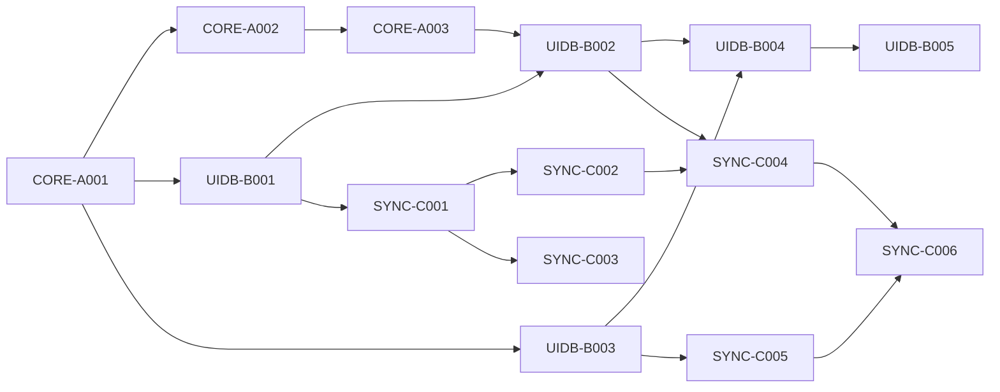

# Active Backlog Summary

**Total Active Story Points:** 52

## Critical Path
1. CORE-A001
2. CORE-A002
3. CORE-A003
4. UIDB-B001
5. UIDB-B002
6. UIDB-B003
7. UIDB-B004
8. UIDB-B005
9. SYNC-C001
10. SYNC-C002
11. SYNC-C003
12. SYNC-C004
13. SYNC-C005
14. SYNC-C006

## Build Order Diagram

## Phasing Strategy
- **In-Scope (Current Phase):** Desktop target exclusively (macOS/Linux). Core FFI parsing, encrypted SQLite storage, and background GitHub sync using OAuth.
- **Deferred (Future Scope):** Mobile targets (iOS/Android) cross-compilation, graph visualization UI, and GitLab support.
